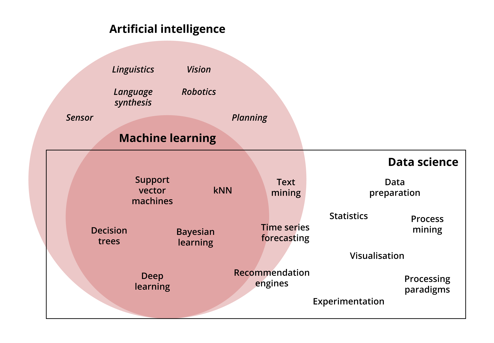
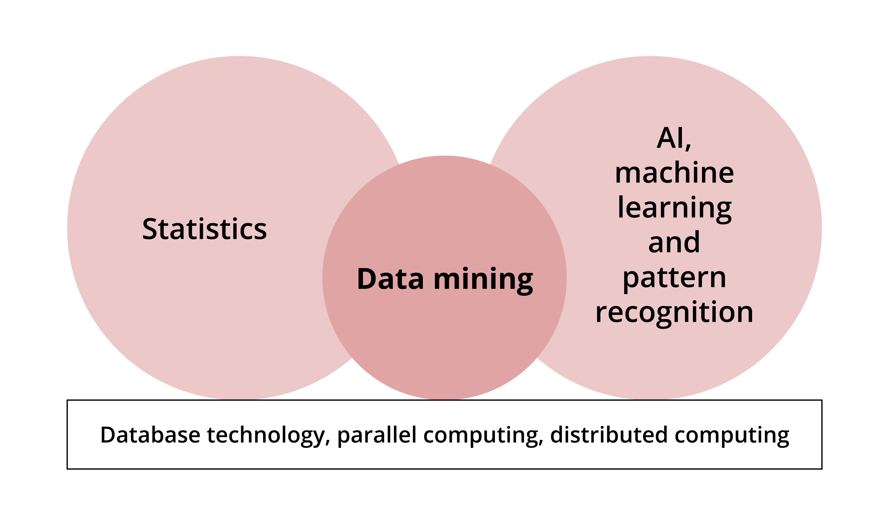
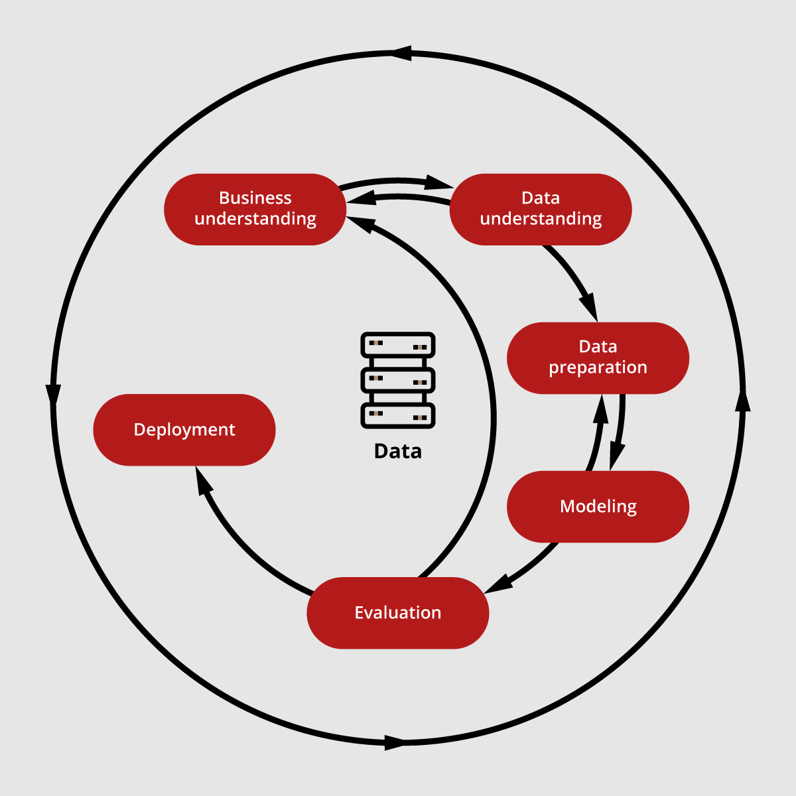

# What is Data Science?

!!! success "Learning outcomes:"
	After completing this lesson you should be able to:

    * understand the typical tasks carried out by data scientists

    * develop an appreciation of the tools and skills required for a data science job

    * understand the CRISP-DM process and ETL

**Data Science is an interdisciplinary field that is concerned with collecting, preparing, processing and obtaining insight from available data.**

Data may be:

* static – unchanging
*	dynamic – changing in forms or format
* from a data stream – a source that keeps generating or churning data, for example a sensor reading or a stream of tweets.

The term data science is designed to resemble other disciplines such as computer science and earth science and reflect that it is a specific, individual field. In the figure, you can see the interdisciplinarity of data science, where a number of topics and techniques are borrowed from artificial intelligence and machine learning.


Kotu, V., and Deshpande B., (2018), Data Science Concepts and Practices, Morgan Kaufman

## What is data mining?

**Data mining is the process of gaining insights into a data set to recognise hidden patterns, known as pattern recognition. This is done through analysis and model fitting – trying to find a model that represents the data, or the process that generates the data.**

The term ‘data mining’ implies excavating a mine (the data archive) to find precious assets (patterns). These patterns are precious because they allow you to make decisions or predictions that are not directly known either from the available data or the process behind it. For example, predicting the best house price from an available set of house prices and their different descriptions. These descriptions when formulated in terms of numerical measures or categories are called the features. The diagram shows the relationship of data mining to other areas.


Tan, P., et.al. (2019), Introduction to Data Mining Second Edition, Pearson

### Data science vs data mining

The terms data science and data mining are sometimes used interchangeably. However, the term data science is a more general term and includes data mining. However, data mining is so important that it eclipses the other term.

## A day in the life of a data scientist

**Below is the typical schedule of a data scientist, showing some of the tasks that might be assigned on an average day. Please do not take it too literally, as it is meant for reflection and as an example.**

1. Wake up, early, and have coffee/tea.
2. Check latest market updates, skim through your alerts/email to see what is ahead of you today and arrive at work, physically or virtually.
3. Visualise the latest market trends, form an idea of what type of questions you need to answer and if you should augment the tasks set up for you today.
4. Integrate the business intelligence results into the market data collected by colleagues to come up with a better market analysis model.
5. Find out that the data collected are not clean enough and lacking some important information that can be retrieved by looking into other datasets. So, delegate the task of cleaning up the data and pre-process or DIY.
6. It is 11:00 now so it is safe to answer your emails without risking your productivity.
7. OK enough of office politics and time for more serious work; integrate the customer web profile and behaviour in order to better target them with relevant products.
8. Have lunch and talk/rant to other colleagues about issues you all are facing in your daily analysis and how fast things are moving.
9. Come back to your senses and start think what to do for your afternoon (apart from your tea-time).
10. Read about the latest technology updates and analysis tools available for data scientists to help you overcome some of the difficulties that you are facing.
11. Finish your light-hearted self-education time and check who is at risk to be lost for a competitor. Analyse the latest customer feedback and send a list of customers that need attention and to be contacted and offered discounts (by the customer services team).
12.	Use your latest developed model to predict the market trend and recommend a set of appropriate pre-empting actions that are expected to mitigate risks and ensure profitability in the long run. Put everything in a nice technical report with lots of visualisation (make sure it is clear and simple even if you spend a lot of time on it) and send to your manager.
13.	Conduct a hypothesis testing to see if a product/service is profitable in the mid and short term for this year and send the results to the project lead for further actions.
14.	Answer some emails, promising the earth regarding those tasks that you could not finish and wrap up for the day.


##Understanding the business needs of the application domain

**In order to gain better insight into factors that can affect their decision process or visualise a situation effectively, or create predictions or analysis to improve efficiency, data scientists need to understand the domain of the company, business or institute.**

It is crucial to be aware of the applications and scenarios that are likely to arise and to have a good insight into the way the business is conducted and delivered. Ideally, this awareness should be formed before starting to do anything, then refined during the analysis and by further contacting the people that your model or analysis is going to serve.

The domains that require data analysis are really diverse. Most domains, including science, entertainment and sport, are making use of the data available to them; for example the time users spend playing a video game, so data scientists may be asked to analyse data from any field to help in the decision-making process.

The diversity of the application domains warrant specialisation into different data science areas; some data scientists specialise in one specific domain, such as medical science. In other cases experts from the domain try to gain experience or qualifications to analyse their own data or include a data scientist in their project. In all cases, insight and understanding of the domain application is needed in the data mining project, either by a data scientist's interaction with domain experts from the company they are helping or by contracting an external expert into the team.

###What questions might a data scientist attempt to answer?

Read through the following examples of questions a data scientist might attempt to answer within different fields, and the sort of data that might be used to answer these questions.

* **Nutrition:** Is this a suitable and realistic diet for me?

      - Society is sharing more of its daily eating habits through social media feeds, likes and interactions as well as through active engagement in specific diet apps. All of this data can be utilised en mass to create recommendations for the best and most realistic diets that individuals will respond to, given past habits, determination and the target that people set for themselves. Although this is not easy, it is doable and more successful apps are being developed that are capable of giving such recommendations.


* **Medicine:** As per the sensor readings, how well is the ICU patient responding to the current treatment?

      - Electronic Health Record data is becoming crucial for collective patients' analyses for diseases and behaviour to aid health specialists in their daily tasks of diagnosis etc.

* **Environmental Science:** How is land temperature affecting ocean temperatures?

      - Oceans play a crucial role in the planet's weather, in both cooling and rising temperatures and violent hurricanes. Both land and ocean temperatures affect each other in obvious and subtle ways. It is important want to know how this is happening, what factors are playing the major role and hopefully predict when one would have a drastic effect on the other. This is a very complex model that involves immense number of features and factors, so data scientists are not expected to model it all; only parts of these natural phenomena are normally addressed in a specific project (although there are some serious attempts to have a comprehensive model).

* **Farming:** How are the monsoon rainfall ratios likely to affect this year's crops?

      - Every single drop of precipitation has an effect on the climate as a whole and studying and developing a model that depicts the intricate relationship between land and ocean is not an easy task. However, there is an immense amount of data that is being registered every day from the large number of climate stations and satellite data that all nations are constantly gathering.

* **Sport science:** Are the current coach's tactics/strategy working well for our team?

      - Data is power and particularly in sport science as it allows the strategy of the team to be set, examined and changed through past experience and trying different tactics. Reinforcement learning (RL) is particularly useful for such a task. You will study this branch of machine learning in the Robotics module. However, you should bear in mind that RL application is huge and anything that potentially has a set of actions to choose from may take advantage of RL capabilities.


##Technology that you might need:

###Jupyter Notebook

Jupyter Notebook is an interactive tool that uses Interactive Python (IPython) to edit and execute Python programmes from a web browser. It provides maximum flexibility and availability for a wide range of devices and users.

You need to install it via python using ‘python -m pip install jupyter’ (pip is now shipped by default with Python 3.4 and above). Alternatively, you can install it alongside many useful programming tools and packages by installing Anaconda Distribution.

We will be running several examples and exercises in the module with code that is already built as a Jupyter Notebook.

!!! warning "Install Python and Jupyter Notebooks"
	To install Python and Jupyter Notebooks, follow the guidance to install Anaconda on the Anaconda web pages:

    * <a href="http://www.anaconda.com/" target="_blank">Anaconda Home Page</a>
    * <a href="https://www.anaconda.com/products/individual" target="_blank">Anaconda Individual Installation</a>

    Once you install Anaconda Python, your system should also be ready to run Jupyter Notebook. The way to start the Jupyter notebook server program will vary depending on the operating system you are using.

    On Linux systems, you typically start Jupyter as follows:

    * open a terminal window (for entering system commands)
    * change folder to the folder that will be the start folder for Jupyter
    * start Jupyter with the command:
    ```
    jupyter notebook &
    ```

###RapidMiner

RapidMiner is a graphical user interface tool that allows you to build and use machine learning and data mining models. You simply can drag and drop operators that represent a technique and then link it up with a data source.

It allows you to apply the techniques you are studying on the data easily and intuitively. There are a set of model parameters that you can set up, which allow you to control the behaviour of the technique. Concepts such as validation and performance measures are also offered as operators that you can add to your model.

This, and similar tools such as Weka, allow you to create a data mining model (prototype) quickly without having to use a programming language to do it. You can still integrate it with other programming languages such as Python. Bear in mind though, that the flexibility and control offered by a programming language cannot be matched by such a tool.

!!! warning "Installing RapidMiner"
    To install RapidMiner, follow the instructions below:

    * Go to the <a href="https://rapidminer.com/" target="_blank">RapidMiner website</a>.
    * From the menu at the top of the page, hover your cursor over ‘products’, and from the dropdown list select ‘educational program’.
    * On the next page, select the ‘Get Started’ button.
    * When prompted, enter your University of Leeds email address (you will not get a student license if you do not use your official University of Leeds email), and the details requested, then select the download button.
    * This will take you to the downloads page. Select your operating system and follow the installation instructions. Note that you need a java virtual machine in your machine. As it stands, at the time of writing, RapidMiner needs Java 8 and will not work if you have Java 11 only. If you have both you will need to specify Java 8 as your default java version.

    Installation in Windows is straightforward. In Linux, it may need a couple of tweaks and below are steps for installation (the Linux flavour that we show is for Ubuntu).

    To start RapidMiner:
        ```
        bash ~/Downloads/rapidminer-studio/RapidMiner-Studio.sh
        ```

    You will need to change the path to RapidMiner-Studio.sh if you have stored RapidMiner in a different folder.

    If RapidMiner refuses to start, then try the following steps:

    1. Make sure that you install Java 8 (even if you have Java 11)
        ```
        sudo apt install openjdk-8-jre-headless
        ```

    2. Make sure that Java 8 is your default version  
        ```
        sudo update-alternatives --config java
        ```

        You will see a series of options similar to those in the image below; select whichever option corresponds to your java 8 and hit enter. In this case it would be option 2.

        

    3. If RapidMiner is still not starting and you do not use assistive technology in java 8 and do not want to install it, then edit the accessibility.properties file:
        ```
        sudo nano /etc/java-8-openjdk/accessibility.properties
        ```

    4. Start RapidMiner
      ```
       bash ~/Downloads/rapidminer-studio/RapidMiner-Studio.sh
       ```

###Radoop

<a href="https://docs.rapidminer.com/latest/radoop/" target="_blank">Radoop</a> is an extension of RapidMiner that allows you to make use of Hadoop ecosystem. RapidMiner is explained below. Radoop allows us to deal with big data and distributed application. You would need to have a Hadoop ready cluster in order to use it. The easiest way is to install a <a href="https://www.cloudera.com/downloads/hortonworks-sandbox.html" target="_blank">Horton sandbox</a> and connect RapidMiner to it for big data and distributed application.  

For more information on using Radoop, watch this video on YouTube: <a href="https://www.youtube.com/watch?v=DkBXB6-mE38" target="_blank">Introducing Radoop: RapidMiner</a>.

###Hadoop ecosystem

To deal with big data later in the module, it will be useful to have the same environment that businesses normally use to process big data.  

This is the Hadoop ecosystem. Although Hadoop requires a commodity hardware, which can be provided via virtual machines, running multiple virtual machines inside your PC and processing a big dataset might be challenging.  

Therefore, in order to mimic the producers and constraints that are normally faced in business scenarios, you will deal with a reasonably sized dataset that is big in the context of capabilities of average machines. You will need an 8 GB RAM and 10GB disk space, if you do not have this then you may need to use a cloud-based or remotely accessed machine. For more information about Hadoop see the tutorial in LinkedIn. You will not be required to be familiar with all the Hadoop ecosystem, you will just make use of its infrastructure to process and analyse some data. This will be easily done by using the Hortonworks Sandbox.  

The basics about MapReduce as a distributed programming paradigm will be explored in Unit5. Some of the most well-known Hadoop tools include HDFS, Yarn, MapReduce, Hive and Spark. More information on these tools is available by selecting this link: <a href="https://databricks.com/glossary/hadoop-ecosystem" target="_blank">Databricks: Hadoop Ecosystem</a>.  

###Hortonworks sandbox

To run Hadoop ecosystem alongside of RapidMiner you need to setup a Hortonworks sandbox. Basically, it is a virtual machine that has the Hadoop ecosystem readily set up and available.  

To learn more about Hortonworks Sandbox, watch this video from Hadoop on YouTube: <a href="https://www.youtube.com/watch?v=H0KXnfE9Z9s" target="_blank">Hadoop Tutorial: Introduction to Hortonworks Sandbox</a>.


##Data pipeline and mining process (CRISP, ETL)

**This module will focus on the cross industry standard process (CRISP) model of the data mining process, which is outlined in the diagram below.**

 
Tan, P., et.al. (2019), Introduction to Data Mining Second Edition, Pearson.

CRISP is a widely used analytical model. It is an open standard process model that describes common approaches used in data mining, involving the following phases:

* understanding the business scenario that the data mining process will be performed for
* understanding the data involved in the task and defining what is and isn’t needed
* preparing the data in order to make the data mining task less cumbersome and easier to achieve
* fitting a model that performs the required task
* evaluating the model using metrics that are suitable to the task in hand (evaluating classification is different to evaluating regression or clustering)
* deploying the model to be utilised by the business.

Note that everything revolves around the data, which is central to the whole process. The data dictates and influences almost everything, including what can and cannot be done, i.e. the task.

##Data mining tasks

**There are several types of data mining tasks that dictate which type of techniques can be employed to model the data and develop the required prediction or modelling.**

###Classification

Classification is the most important and prevalent type of task a data scientist normally performs. The idea is to view the problem in terms of a set of known predefined classes. The dataset reveals the class, sometimes called the label, of each individual record which usually represents a physical or virtual entity such as a car, disease or level of success.  

In short, the dataset or data stream has a nominal value already available and the data scientist needs to discover how to produce the correct class of a record based on the features of the object. For example:

* Given a of a set of car features such as body type, top speed and engine specs, it would be possible to define the car model.  
* From millions of images of a set of ten types of vehicles, such as trucks, sedans, SUVs, coupes and hatchbacks, it would be possible to create a data mining model that is capable of identifying the type of the vehicle in an image. The set of features in this case would come from processing the pixels of the images.  
* From a dataset containing thousands of images of ten digits (0-9) that are handwritten by hundreds of people with different writing style, a model could be created that is capable of classifying the digits automatically. Such a system is immensely helpful in automatically distinguishing the address of a letter automatically to disperse it to the correct pile in a post office.

###Clustering

Clustering is the second prevailing task performed by a data scientist. In this case there is a dataset or data stream representing a set of objects but the dataset does not reveal what the label of a record is. The data records still need to be categorised or clustered into related sets to help with other tasks.  

For example, a set of social media users could be categorised into clusters of strongly connected groups based on their likes of specific kinds of products in order to target them with relevant adverts.

###Regression

Regression is the task of developing a specific value rather than a class for a record. For example, to identify the price of a house based on set of its features, such as address, number of bedrooms, square footage, floors, open kitchen aspects, en-suits etc. In this case, a dataset of houses with their prices (label) is needed and a model needs to be built that predicts house prices, which can be used later with new houses coming to the market to correctly estimate their values.  

##Supervised learning vs unsupervised learning

**You might have realised that there is an important difference between classification and clustering; in classification the classes are known, while in clustering they are not.**

The first task (classification) is called supervised learning due to this crucial difference. The answers of the model are supervised and adjusted when it learns to classify an object.  

In the second task (clustering) the classes are not known and it is left to the model to learn the important features that it will use in order to come up with the clusters. The word learning here is also key. The idea is that the model learns from the data rather than being provided with biased calculations or directly programmed to perform the task – this is known as unsupervised learning.

As an example of learning vs following instructions (programming), consider a robot which needs to be moved from point A to point B. The options to move the robot are:

* give it a set of specific instructions of how to move left or right with how many meters to reach point B
* allow it to learn by itself, via trial and error, to formulate a suitable trajectory to reach point B.  

To allow it to learn by itself, it still needs to be provided with suitable learning algorithms, that are eventually programmed, but these are not tied to the current setting. If the plan is changed to move the robot to a third point, point C, these can be employed regardless of when this change happens. In this case, the robot will be left to learn again by itself how to move from A to C and the programme should not be changed.  

From this example, you can see that learning is more generic and will achieve real intelligence with time, while programming precise steps forces the programmer to solve a problem.  When this programming happens, the device will only implement the programmed solution, however when the agent is provided with the capability of learning, it is equipped with more intelligence. This will make it more powerful and useful (at least for the time being, you will see more in-depth discussions of the issues of ethics of AI in a separate module).

###Video: Introduction to data science

Please watch the following video, in which Abdulrahman Altahan introduces data science in more detail:

<p align="center"><iframe title="Data Science Introduction" width="450" height="300" frameborder="0" scrolling="auto" marginheight="0" marginwidth="0" src="https://mymedia.leeds.ac.uk/Mediasite/Play/89c81b0df9f8407786d7b8eea7fa93c01d" allowfullscreen msallowfullscreen allow="fullscreen"></iframe></p>

You can also download the <a href="https://minerva.leeds.ac.uk/bbcswebdav/xid-18739454_4" target="_blank">slides shown in the video</a> and the <a href="https://minerva.leeds.ac.uk/bbcswebdav/xid-18826019_4" target="_blank">transcript here</a>.

Slides are reproduced from Tan et al (2019), <a href="[https://www-users.cs.umn.edu/~kumar001/dmbook/index.php#item4" target="_blank">Introduction to Data Mining</a>, with kind permission of the authors.

##Systems and unit testing vs model testing

###System testing

This is testing whether a system is working as intended. It normally investigates the integration of different components and whether there are any issues that might arise due to integrity. This can be due to:

* unintentional variable changes when they are communicated between the different components of a system  
* human activity that is overlooked during the system design
* programming error.

These types of faults can be categorised into accidental, logical, flow, and implementational.  

###Unit testing

Unit testing is testing an individual module or component of a system. As with system testing, it is normally conducted for logical or implementational error regarding the intended functionality of the unit. This type of testing is more prevalent and occurs several times in the life of the component, whenever there is a change to its functionality or coding.  

###Model testing

Note that systems and unit testing are not likely to be performed by a data scientist. The likely testing activity that a data scientist is going to perform is model testing.

Model testing depends on the task in hand whether it is classification, clustering or regression. In model testing the prediction performance of the model and its level of accuracy in performing the required task are tested.

Often, when dealing with graphical user interface (GUI) based data mining tools such as RapidMiner (or other industry used tools you may come across such as Weka), the concern will be on raising the model performance by changing its parameters or the technique used. Alternatively, several techniques are employed and their performance compared. Model testing is not concerned with whether the coding for a technique is working properly but whether the model is capturing the internal mechanism of the data generation process or whether it is able of dedifferentiating between a set of different classes.  

##Types of models: generative vs discriminative

**The previous points all lead to the idea of types of models. There are several ways to categorise a data mining model. For example, the models may be categorised by task, such as a classification model, clustering model or a regression model.**

However, this simply expresses the type of task that the model is dealing with. There are two other types of models you need to be aware of – generative and discriminative.

**Discriminative models:** Discriminative models can be categorised by addressing their intrinsic capabilities. This can distinguish between models that are capable of only discriminating between the different classes.

**Generative models:** These are another type of model, capable of generating synthetic data that is likely to come with the tasks being dealt with. These are more powerful than discriminative models, but they are more difficult to build and often need more computational power. The quality of the data they generate depends on the task and the technique employed to build such models. Often, they are built by employing statistical distribution and statistical techniques, in particular Bayesian models, which depend on Bayesian Inference and Bayesian Statistics as opposite to Frequentist Statistics. Bayes Theorem will be explored further later in the unit.

Whether you build generative or discriminative models will depend on the context that the model will be used in. Sometimes it is completely unnecessary for the model to be able to generate the data and in this case discriminative models are sufficient to the task in hand. Sometimes you might want to combine a discriminative and generative model to train each other to get better at the task. An example of such models is the generative Adversarial Neural Networks. You will be studying such models in later modules (Machine Learning, Deep Learning and Reinforcement Learning).

##Bayes Theorem and its application

**Bayes Theorem is the backbone of Bayesian Statistics and Bayesian models. As opposed to Frequentist Statistics, Bayes Theorem defines the probability (P) of an event (H) conditioned on another event (E) as follows:**

$P(H|E) = P(E|H).P(H)/P(E)$

H is the hypothesis (like a disease), E is the evidence (like a Symptom). In the following example, drawn from medical data, the hypothesis is a disease, and the evidence is a symptom.

The rule states that the probability of having a disease (H) given that a patient has a symptom (E), equals the probability of having symptom E, given that the patient is known to have a disease H times the probability of having a disease H divided by a normalisation factor (the probability of having a symptom E).  

This rule is useful due to its practicality. Bear in mind that calculating the probability when it is known that a patient has a disease is much easier than trying to diagnose or estimate the probability that a patient has a disease given they have a symptom.

In the following set of examples you will see how we can apply the Bayesian rule in order to come up with a probability of a patient having a particular disease given a set of symptoms (diagnosis).

Your understanding of how we apply these rules will be beneficial to you later in the course.

####Example 1
In this example there are three diseases (D) and one symptom (E).

In a set of 100 patients:

* 25 have disease D1
* 15 have D2
* 50 has D3.

Within this set of patients, the following number have the symptom (E1):

* D1: 5
* D2: 10
* D3: 40.

The Bayesian rule dictates that the probability of having disease D3 given that a patient has symptom E1 is:

* P(E1|D1) =   5/25, P(D1) = 25/100, P(E1) = (5+10+40)/100=0.55
* P(E1|D2) = 10/15, P(D2) = 15/100
* P(E1|D3) = 40/60, P(D3) = 60/100
* P(D1|E1) = P(E1|D1).P(D1)/P(E1) = 0.20x0.25/0.55 = 0.091.
* P(D2|E1) = P(E1|D2).P(D2)/P(E1) = 0.66x0.15/0.55 = 0.182.
* P(D3|E1) = P(E1|D3).P(D3)/P(E1) = 0.66x0.60/0.55 = 0.727.

So it can be concluded that it is more likely that the patient has D3 than the other diseases. But this does not mean to exclude the possibility that the patient has D1 or D2.

Please note that P(D1|E1) + P(D2|E1) + P(D3|E1) = 1.

####Example 2: Bayes for multiple evidence
For this example, assume further evidence has been obtained from the example 1 statistics about symptom E2:

* 3 patients with D1 have E1 and E2
* 10 patients with D2 have E1 and E2
* 10 patients with D3 have E1 and E2.  

If a patient who has E1 does not have E2 then the probabilities of having diseases D1, D2 and D3 given (E1,¬E2) will be adjusted according to the new evidence as follows [please note that (E1,¬E2) means (E1 and not E2)]:  

* P(D1|E1,¬E2) = P(E1,¬E2|D1).P(D1)/P(E1,¬E2)   
* P(E1,¬E2) = [(5-3)+(10-10)+(40-10)]/100= 0.32  
* P(E1,¬E2|D1) =  ( 5 - 3)/25 = 0.08
* P(E1,¬E2|D2) = (10-10)/15 = 0.00
* P(E1,¬E2|D3) = (40-10)/60 = 0.50
* P(D1|E1,¬E2) = P(E1,¬E2|D1).P(D1)/P(E1,¬E2) =0.08x0.25/0.32=0.0625
* P(D2|E1,¬E2) = P(E1,¬E2|D2).P(D2)/P(E1,¬E2) =0.00x0.15/0.32=0.000
* P(D3|E1,¬E2) = P(E1,¬E2|D3).P(D3)/P(E1,¬E2) =0.50x0.60/0.32=0.9375

Therefore, with the new evidence that states that the patient does not have symptom E2 the patient is likely to be diagnosed with disease D3. The new evidence also suggests that they cannot have D2 and their chances of catching D1 are low.

####Example 3: Bayes for multiple evidence with conditional independency
This time assume that further evidence from Example 1 statistics about symptom E2 has been obtained. The information states that:

* 15 patients with D1 have E2
* 15 patients with D2 have E2
* 24 patients with D3 have E2.  

Note that the numbers for patients with D1 who have both E1 and E2 are not known. Only the numbers of patients who were diagnosed with D1 and have E1 have been provided. Separately, the number of patients who were diagnosed with D1 and who have symptom E2 are available. This is not normally enough to infer anything regarding (E1,¬E2|D1).  

However, if given further information that E1 and E2 are independents with respect to D1, D2 and D3, this is called conditional independency between E1 and E2 given D1, and it is an important concept in probability theory.

The conditional independency means that knowing that a patient who has D1 (or D2 or D3), shows symptom E1 will not provide information on whether the patient might or might not show E2, and vice versa.  Formally, this guarantees that P(E1,E2|D1) = P(E1|D1).P(E2|D1).  

* P(E1,¬E2|D1) = P(E1|D1).P(¬E2|D1) = (  5/25) x (25-15)/25 = 0.20x0.4=0.08
* P(E1,¬E2|D2) = P(E1|D2).P(¬E2|D2) = (10/15) x (15-15)/15 = 0.66x0.0=0.00
* P(E1,¬E2|D3) = P(E1|D3).P(¬E2|D3) = (50/60) x (60-24)/60 = 0.83x0.6=0.50

* P(E1,¬E2|D1).P(D1) =0.08x0.25=0.0625
* P(E1,¬E2|D2).P(D2) =0.00x0.15=0.000
* P(E1,¬E2|D3).P(D3) =0.50x0.60=0.9375

Although there are 54 patients who have E2, the count for (E1,¬E2) is not available to be able to infer P(E1,¬E2). However the probability of (E1,¬E2) can be worked out from the following:  

* P(D1|E1,¬E2)+P(D2|E1,¬E2)+P(D3|E1,¬E2) = 1
* P(E1,¬E2|D1).P(D1)+P(E1,¬E2|D2).P(D2)+P(E1,¬E2|D3).P(D3)]/P(E1,¬E2) = 1
* P(E1,¬E2)=P(E1,¬E2|D1).P(D1)+P(E1,¬E2|D2).P(D2)+P(E1,¬E2|D3).P(D3)=0.32.

Note that this is the same probability that was calculated in example 2 through a direct given count of (E1,¬E2). This also shows that P(E1,¬E2) acts as a normalisation factor. The rest of the calculations are identical to example 2, which shows that conditional independency can compensate lack of individual counts of an evidence.

Note that the probability framework does not assign a degree to which a symptom exists in a patient; the symptom either exists or not. Of course, there are ways to work around this, but it is outside the scope of what is being discussed here. There is also the idea of assigning priors to the probabilities which is essential in the Bayesian framework, these issues along with other Bayesian methods, such as Naive Bayes and Graphical models will be explored further in the Machine Learning module.


##Measuring the performance

**A way to measure the performance of any prediction or data mining model that is developed must be specified. The metrics will depend on the type of the data mining task that is performed.**

Classification has different metrics than regression which in turn has different metrics than clustering. You  will see each one in their respective unit. It is worth mentioning here that these metrics will be essential in developing the model as they will provide the guidelines along which several different algorithms can be developed.


##Summary

**In this lesson you have explored the basic ideas of data science data mining and the type of tasks a data scientist is normally assigned.**

In the next lesson you will consider the data, which is the main substance of a data scientist's work.
