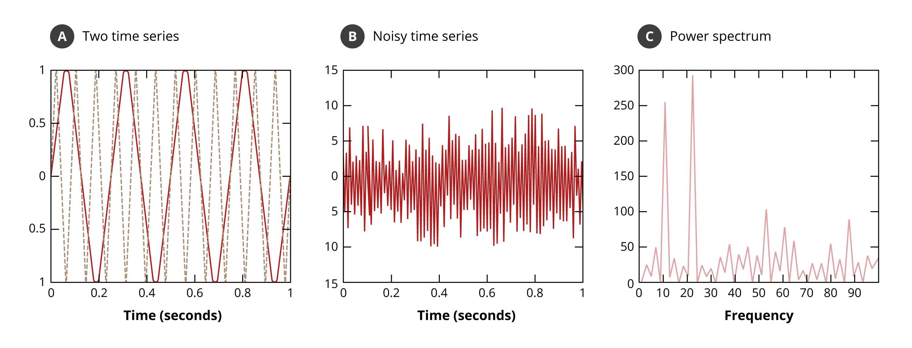
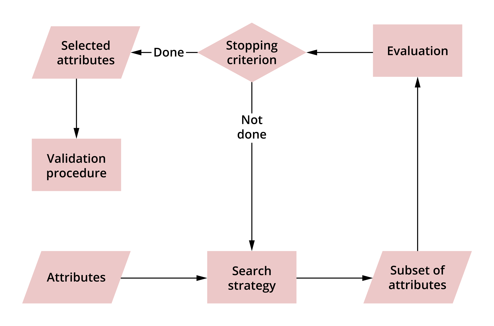

# Data preparation

In this lesson you will learn about the different techniques for data preparation.

!!! success "Learning outcomes:"
	After completing this lesson you should be able to:

	* perform data wrangling
	* solve data quality issues
	* perform feature selection and simple dimensionality reduction
	* explain why these techniques are performed and when.

**As you saw earlier, data comes in all sorts of formats and shapes and in order to be able to perform any analysis, you would need to make the data suitable for the task in hand.**

There are broadly two main reasons to do this:

1. The data is often collected separately and detached from the mining task. Often there are specific data techniques that are known to suit the task in hand, so the nature of the techniques dictates some specific data preparation regime that you would want to carry on the data. For example, for some tasks, new features need to be generated from the original features, for some other tasks the shape of the data need to be changed.

2. Even without consideration to any specific task or technique, often the data can suffer from issues that need to be addressed before any analysis is carried through. These issues include noise, repetition, missing-ness and scalability.

##Data pre-processing in context

Before you do any processing, you need to understand the specific task and in what way the data will be utilised and in what context. The data can come in a form or format that, if not changed, will make the analysis process itself unnecessarily more difficult. This applies to simple queries or more complicated tasks – they all require an appropriate level of preparation to ensure that the analysis or querying process is smooth

##Data wrangling and ways of data pre-processing

A data scientist must often wrestle with the data to make it suitable for their needs, a process known as data wrangling. The process somehow involves a bit of haggling and hacking and often, in order to perform the process, the structure and shape of the date needs to be checked and reviewed. This section will give you a quick overview of some of the techniques used.

###Sampling

The concept of sampling is widely used in statistics and data mining. In statistics the default position is that obtaining the entire data population is often infeasible and physically too expensive. In data mining, processing the entire dataset, even if it is available in some storage, might be too computationally expensive to do.

<a href="https://bibliu.com/app/#/view/books/9780273775324/pdf2htmlex/index.html" target="_blank">Read section 2.3.2 (pp.72-76) of Chapter 2</a> in the text Introduction to Data Mining. This section will give you further information on sampling and the different types of data sampling that can be conducted.

In both statistics and data mining, a subset of the data is sampled, by selecting some of the rows rather than all of them). Sampling is done randomly to avoid a biased representation of the data, which would be misleading for the model.

There are several approaches to this randomisation, and the most notable is **stratification**, which is maintaining the distribution of the underlying data when it is sampled. The idea of stratification is commonly used in data science, so understanding it helps in several situations.

In **proportionally stratified sampling**, sampling is conducted as per the group of objects distribution/ratios in order to preserve the footprint of the original dataset in the sampled dataset.

###Example

There is a dataset of three classes – A, B and C. The distribution in the original dataset, which contains approximately 10 million records, is roughly:

* A: 65%
* B: 25%
* C: 10%.

If this data is sampled randomly, without taking into consideration the distribution of the classes, this distribution might change if the randomisation is unlucky.

If class C is oversampled, the sampled dataset may end up with the distribution of, for example:

* 60%
* 20%
* 20%.

This would have a knock-on effect on the results of the model. To avoid such a situation, it can be decided in advance to sample, for example, 50% of the entire dataset.

By sampling 50% of each class separately and then combining the resultant record, the same class distribution of the original dataset (65%, 25% and 10%) would have been maintained, despite having half the number of records. Similarly, if the target is to balance a dataset of two classes to compensate for a rarity of one of the classes then equally stratified sampling can be employed to make sure that there is 50% of both classes.

The concept of sampling occurs indirectly when the dataset is split into training, testing and validation. When training a model to recognise a class the performance of the model should be evaluated after it has been built or deployed. To do this, the same dataset available for training a model (making it learn from the data) and for evaluating it often has to be utilised. This means that a small proportion of the dataset for testing ought to be set aside, for example, 30%.  

In this case the scheme for the desired sampling also applies for splitting the data. In particular, the testing data should almost always be representative of the dataset and the proportional stratified sampling approach applied, to set aside a 30% of data that the model will not see during training. Once training finishes, the model is applied as it is, without adjusting on the 30% testing data and the accuracy obtained from the model is reported.  

This invites discussion on whether several splits need to be performed and the average reported on, as well as how several models or techniques are compared and validated. Both of these topics will be discussed later, along with how to measure the performance of a model in the next couple of units.

!!! "Note"

		Make sure to differentiate between sampling rows and selecting a subset of fields or columns.

###Filtering

Sometimes a feature must be obtained or deduced from other features. This can be done via a simple calculation on some features, or by larger processing of a set of features to obtain better representation for the task in hand.  

For example, from a set of artefacts, two features are the mass and volume. The density of these artefacts (density=mass/volume) can be deduced, which would be a good predictor to classify items based on the material that they are made of.  

An example of a more involved process is a Fourier Transformation (FT). FT is used to extract or map the data into a new space. It is well known that if two time series with different frequencies and some noise are combined, a surprisingly chaotic signal would be received (which would be what is normally looked at when a real time series is dealt with). However, if FT is applied it will show exactly two time series with two different frequencies. This can be used to filter noise and to extract specific information from regarding one of the two time series.

Please see Figure 2.12 of the reading book. To learn more about intuition of FT, watch this YouTube video: <a href="https://www.youtube.com/watch?v=spUNpyF58BY" target="_blank">What is the Fourier Transform? A visual introduction.</a>

The example in this diagram shows the application of the Fourier transform to identify the underlying frequencies in time series data. For a detailed explanation of the diagrams, read example 2.11 on page 83 of <a href="https://bibliu.com/app/#/view/books/9780273775324/pdf2htmlex/index.html" target="_blank">‘Introduction to Data Mining’.</a>

###Dimensionality reduction

Dimensionality reduction techniques are important, as their aim is to find a reduced number of features that can be used to solve the problem – whether it is regression, classification or clustering etc. Some of these techniques are:

####Correlation

For example, correlation between the features can be used to select a subset of the original set that have minimal correlation. This is guaranteed to have maximum independency between the features which convey the most important information, without an overlap that is conveyed inside the features that are correlated.

####Subset selection

Another example is the subset selection process. This involves removing redundant features, like in the correlation example, and irrelevant features, like the IDs example in the filtering technique.  

Common sense and domain knowledge can be used, although this is not necessarily always accurate. However, the best way to apply a subset selection process is to systematically eliminate features and test how good or bad the data mining task becomes. If it is not affected or improved, then it is the feature can be removed. If the performance of the model is reduced, this is an indication that the feature plays an important role in the task and it needs to stay.  

There is a drawback here; sometimes removing one feature alone reduces the performance of the model by magnifying the noise coming from another feature, but removing a few features (a subset of features) will improve the performance of the model. Please note that both the removed and retained features are subsets of the original set of features. The subset that is kept for the data mining task is referred to as the Feature Subset Selection. Therefore, different subsets should be tried, rather than just individual features.  

However, trying all possible subsets is often impractical. Consider how many possible subsets there would be for a set of 10 features. Take a couple of minutes to think about it.

There would be 1024 subsets. Can you work out what the rule for calculating the number of subsets is?

####Set of all subsets of a Set

Note that the number of features can be hundreds or more, so it becomes impractical to enumerate all of the possible subsets. All the possible subsets of a set are called the power set.  

So, for example, if there is a set S={a, b, c} then its power set is P(s) = {{a}, {b}, {c}, {a, b}, {a, c}, {b, c}, {a, b, c}, {}}, the cardinality (number of subsets) of this set is 8.

The number of items in a set is called the cardinality of the set – which seems a fancy name for such a simple concept. However this concept gets more complicated when there is an infinite set, such as the set of integer numbers or the set of rational numbers. Each of these sets has a different density and both are infinite, but both have the same cardinality. If you take the set of real numbers, it has a higher cardinality. In fact, if you take any real interval, all the real numbers inside it can be mapped! For more information on the cardinality of the continuum, read this entry from Britannica: <a href="https://www.britannica.com/science/continuum-hypothesis" target="_blank">Britannica.com: Continuum hypothesis.</a>  

The diagram summarises a feature subset selection process, which is a search over all possible feature subsets.

Tan, P., et.al. (2020), Introduction to Data Mining by Second Edition, Pearson

As another example, Principal Component Analysis (PCA) applies the ideas of Eigen vectors of a matrix to obtain a new set of features that are more concise and better represent the problem being dealt with. Normally it is not necessarily known what physical measurements the new features represent. Rather, by using PCA it is certain that transforming to the new set of dimensions guarantees a better performance for the model.

!!! abstract "Exercise"

		Given that we have the following attributes {a, b, c, d, e} write the power set for the above set.

####Synonymous features

Synonymous features are two or more features that are effectively equivalent, or one is deduced directly from the other.  

It is better to filter out or remove one of them. This is particularly relevant when there is a feature that is synonymous to the label that you are trying to fit a model to predict its value. If there is a direct effective equivalency or close to equivalency between the two features, one of them is the label and the other is assumed to be unknown (or not available in general) for new data points. Then, the synonymous feature must be omitted when a model is built to predict the label. This is because knowing a synonymous feature means knowing the label, and it is unlikely to be available for data points that we want to predict their labels.

####Normalisation/standardisation and rescaling

Often, one of the most important pre-processing techniques to be performed on the features is normalisation or standardisation and rescaling. This is because the range of one feature can be drastically different than the range of another feature.

Consider the weight and height of a person. If the height is given in meters and the weight in grams then the weight is going to dominate the height during the model fitting exercise, resulting in marginalising the effect of the height on the prediction or clustering. The simple solution is to convert the height into cm or mm. However, this might marginalise other features. The standard way of dealing with such features is to either normalise them or to rescale them.

####Standardisation (aka normalisation)

Standardisation involves calculating the mean x̄ and standard deviation sx of a feature x. This is done by looking into the data that resides inside the feature as samples to calculate these statistical measures. The following transformation is then applied to the data that involves the features x′= (x-x̄)/sx. This is called variable transformation in statistics because it transforms the data from one space to the other. The new features x′ that were calculated out of x has a mean 0 and standard deviation of 1, i.e., it is standardised.

####Rescaling

Rescaling is similar to standardisation, with some differences. The calculations are x′= (x-xmin)/(xmax - xmin) where xmax and xmin are the maximum and minimum values that x might have, respectively.   

This guarantees that the range or scale of the new feature is [0 , 1] (between 0 and 1 inclusive, including all the infinitely possible values in between). Another less stable way to rescale is to do x′= x/xmax, which assumes that the minimum value for x is 0, but even if it is not, if the minimum value for x is positive then the range of the data will be [xmin/xmax , 1].

Note that if we do not know what {xmin, xmax } values might be (or potentially they can go -+ infinity) then we can take them from the values in the available data itself. However, we have to be careful in how we do this, as it might lead to data leakage when the dataset is rescaled before splitting (into training and testing).

####Specifying the label for supervised learning

The label is the answer to the question or problem being solved. Often in supervised learning settings, the dataset contains the features as well as the label for each record.

An example of this is a dataset that has a set of purchases of customers. From this dataset, a prediction is needed about whether they or someone in their household is pregnant. The dataset would contain a set of purchases for each customer and whether they are pregnant or not – this field would be the label. Later, once a model is fitted that predicts whether a customer is pregnant or not, the model can be utilised for new customers in order to directly offer items related to pregnancy if they are pregnant.  

Another example is the Titanic dataset, where the set of features are the information of the passengers such as their:

* ticket fare
* name
* age.

The label is simply their survival info (binary: survived or did not survive). The task would be to fit a model that estimates if a passenger survived or not based on their information.

####No label: unsupervised learning

Sometimes it is not clear what the label is for the task or the task itself is not to predict a label. Instead, it is to associate a set of items with each other or to cluster the items based on their resemblance to each other. In these cases, unsupervised learning techniques can be utilised which do not require a label. Sometimes the label is simply ignored to gain more insight of the data.

####Dealing with missing-ness

This is a common problem for realistic datasets. Most likely, the same information is not obtained for all the objects/people (called data points because they are represented as a data point in a multi-dimensional space). For example, the age or the weight of a person may be missing due to human error or due to the information not being required (especially when the data collection process is not automated).

Sometimes the missing data is completely random and is due to collection issues, but may reveal a tendency related to the underlying object or phenomena that is being analysed. For example, a notion of privacy might prevent people from revealing their information.  

In this case, the missing-ness issue of the dataset needs to be dealt with. One drastic thing to do is to illuminate any record that has a missing field in it – called imputation. This would make the dataset more uniformed and ready for applying whatever data mining technique intended, but at the expense of losing the data points that have missing fields. Such an approach is not usually advised, especially with small or medium datasets. Even if the data is large, if the missing data is not random then removing the related data points can introduce a bias in the model.

For example, you have dataset for people’s ages, salaries and marital statuses, which will be used to predict if a person will default on a debt or not. If people with high salaries tend not to reveal their salaries, then removing all data points with a missing salary will introduce a bias in the build model. This will result in much less accuracy in performing the data mining task for people with high salaries.

Another way to deal with the missing fields data is to provide an estimate of this data. However, an estimate is not precise, and a loss of accuracy is expected for the model because when with estimates there may be some noise and bias introduced as well.  

So, how should you estimate? An unbiased estimate would be the mean of the feature. Take the entire data for a filed – vertically – and calculate the mean for it, replacing all the missing values with this mean.

####Aggregation and summarisation

When you want to group by a specific field to apply some calculation or summarisation operations, aggregation and summarisation is used. This means the data is gathered and presented in a summarised format, for example, grouping a dataset by gender and apply a sum or mean of wages to see the differences or inequality between the wages per gender.  

####Discretion and binarisation

These are standard techniques used to convert a continuous attribute which potentially has infinitely many possibilities to an attribute which has a confined number of possibilities. Often this is done to allow more efficient processing or to suit a classification or clustering task in hand.  

**Discretisation** is a process that converts continuous data attribute values into a discrete form, meaning they are converted into a finite set of intervals and associate each of these intervals with a specific data value.

**Binarisation** is the process of converting attribute values to binary values i.e. ones that have two values (often these are {0, 1}). Binarisation is a special case of discretisation. One form of discretisation is called histograms, where the number of occurrences of a range of values into a set of bins in counted. The set of bins replace the feature, and in this case, one attribute is replaced with as many bins as we have.

####Melting and pivoting

Melting and pivoting are often overlooked operations. When they are applicable, it is important that they are performed to make the shape of the data suitable for further processing. These are often part of a more elaborate operation involving data preparation along other operations such as sorting etc. Please refer to the next exercise for a full working example in Python. See the following <a href="https://leeds365-my.sharepoint.com/:p:/g/personal/scsaalt_leeds_ac_uk/EXYe9TF0RytAh6KlMnMU3aYBslNRRDa-QNQwpOTHPWUwpA?e=OyGir5" target="_blank">slides.</a>
<mark>Will slides be video or a link out to powerpoint? Needs confirming and editing accordingly.</mark>

!!! abstract "Exercise"
		In this exercise you will be given a dataset to prepare for further analysis.

		The exercise covers several of the techniques mentioned in this lesson for data preparation and data wrangling. Follow the steps and execute them in order and experience the effect of the data preparation procedure on the data.

		You can access the code in the <a href="https://leeds365-my.sharepoint.com/:u:/g/personal/scsaalt_leeds_ac_uk/EX9xS8O3x-dCso4VwiUBoH0BjDzN3ujjSUSXPgRhFlq0mA?e=fkIcRw" target="_blank">Data Wrangling Jupyter Notebook.</a>
		<mark>Exercise currently hosted in personal onedrive, needs to be moved to appropriate location.</mark>

##Summary

<mark>**In this lesson you have**</mark>
