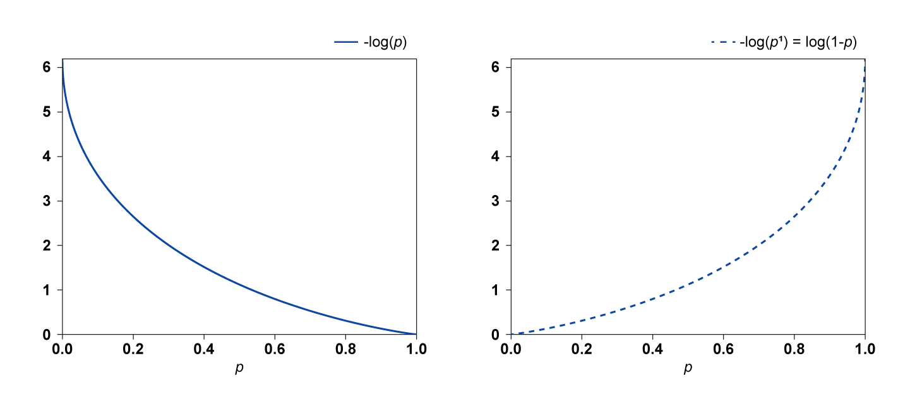
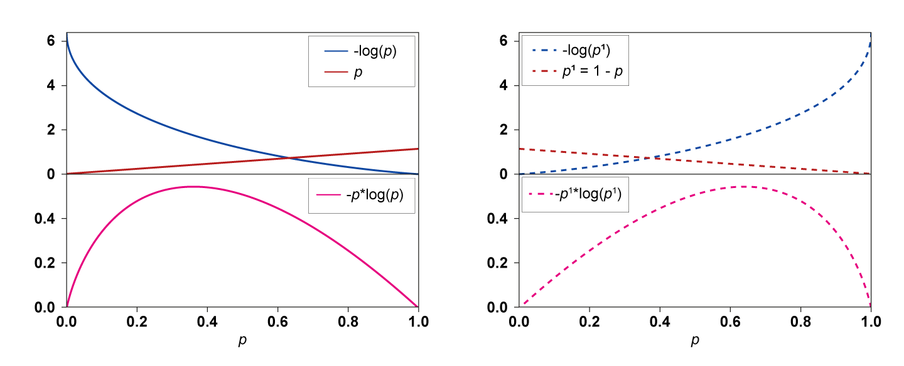
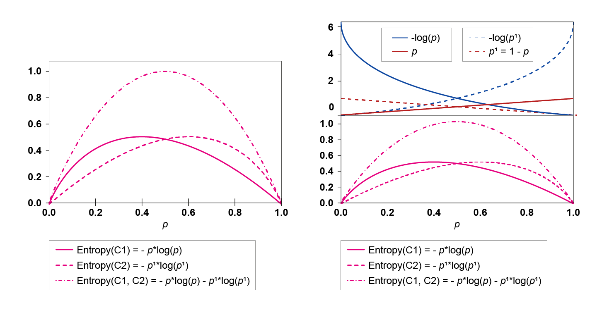
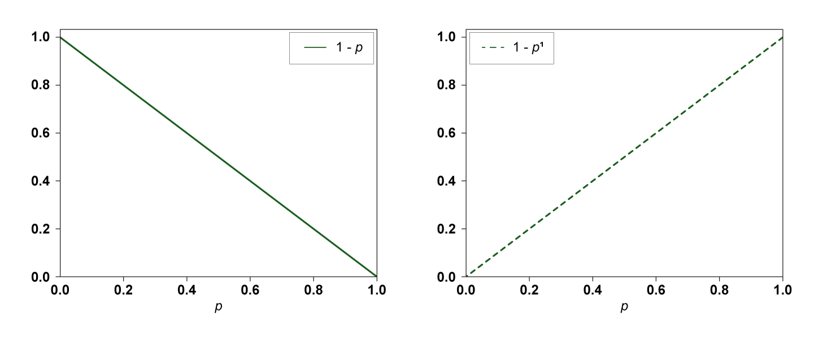
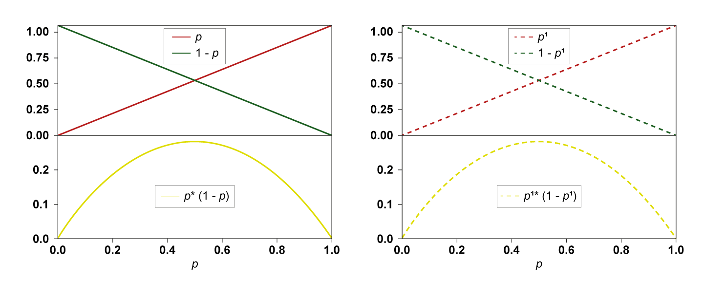
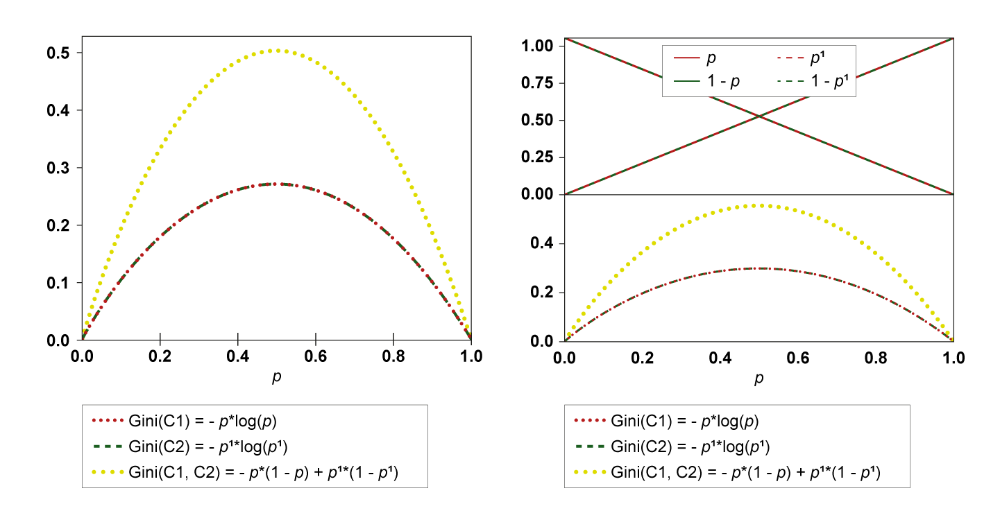
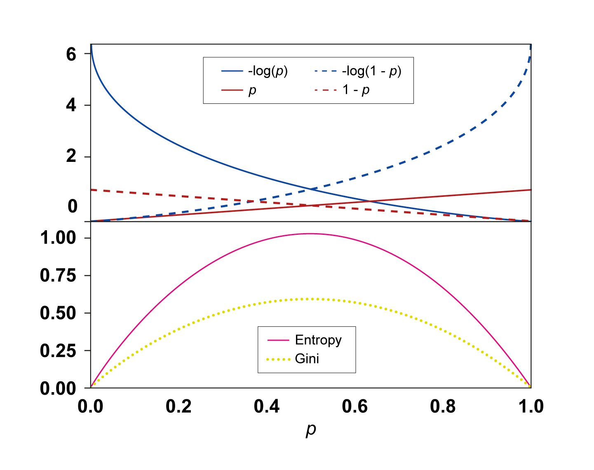

# Decision tree induction (training)

In this section, we cover the decision tree building algorithm which is also known as induction. We will look here at the CART algorithm.

In the simplistic dataset below, you can see a set of  records relating to phones and tablets. The dataset allows us to classify a devices that is not part of the dataset to find out whether it is a phone or a tablet.

In the  dataset, the possible values for the features and the class are as follows:

Screen size = {6, 7, 8}, Makes calls = {Yes, No}, Class = {Phone, Tablet}

Device | Screen size  | Makes calls | Classification
-------|--------------|-------------|---------------
G1     |     6 inches | Yes         |Phone
S1     |     6 inches | Yes         |Phone
A1     |    7 inches  | Yes         |Phone
G2     |    7 inches  | No          |Tablet
S2     |   7 inches   | No          |Tablet
A2     |   8 inches   | Yes         |Tablet

Intuitively, the ‘screen size’ feature does not have an easy binary decision since in this dataset we have phones that are 6 and 7 inches and we have tablets that are also 7 or 8 inches. On the other hand, ‘makes calls’ feature is more regular, **all** phones ‘make calls’ while **most** tablets do not ‘make calls’. This suggests that if we were to make decisions about a device class being a phone or a tablet, we should first look at the ‘makes calls’ attribute and if it is ‘no’ then it is a ‘tablet’ if it is ‘yes’ then it is most likely a ‘phone’. In this second instance we would then need to check its ‘screen size’ if it is = 8 then it is a tablet, if it is not then it is a phone.

So how we can create an algorithm that does this type of decisions for us? We need an algorithm that can strategically pick the more promising features first and then develop the tree based on that. The algorithm that we will talk about is called CART (Classification and Regression Tree) and we will show it in action in the following steps.

##Step 1 of CART algorithm

**To be able to develop this algorithm we need to measure how promising a feature (with a specific value) is as a partition for our dataset. Think about the above dataset. The ‘makes calls’ feature allowed us to split the data two ways with a low impurity.**

<figure role="group">
  
  <figcaption><strong>Figure 2.1.</strong> Illustration of step 1 of CART algorithm for tablet vs phone dataset. Left split based on ‘makes calls’ feature, right split based on ‘screen size=8’ .</figcaption>
</figure>

To quantify the quality of each split, we use the **Gini Impurity** of each **node data**. The Gini impurity describes how pure or mixed the data labels in a node are. The purer the data the closer Gini is to 0, while the more mixed the data in the node the closer Gini is to 0.5. We will look at how to calculate the Gini Impurity a bit later. For now I want you to assume that you know how to calculate it.

###Information gain
The **Information Gain of a split** refers to how much information we gain by choosing one of the possible splits. If the decision tree is binary, then each feature is a possible split. If it is not binary, then each pair of a feature with a value is represented as (feature, value), and will constitute a possible split.  

If we would like to decide which of the above two splits is better, then we just calculate the information gain and we choose the one that has the highest information gain.

$$
\begin{array}{l}
\text { Information Gain }=\text { Impurityof parent-weighted average impurity of children } \\
\qquad \begin{array}{l}
\text { Info Gain('makes calls') }=0.5-\left(\frac{2}{6} \times 0+\frac{4}{6} \times 0.375\right)=0.25 \\
\text { Info Gain('screen size } \left.=8'{\prime}\right)=0.5-\left(\frac{5}{6} \times 0.48+\frac{1}{6} \times 0\right)=0.1
\end{array}
\end{array}
$$

This shows that the first split based on the ‘makes calls’ feature is better since we gain more information by using it and we will intuitively move toward more pure leaves.

###Gini impurity

**It is time now to see how we calculate the Gini impurity. We take the probability of one label in the node and we multiply it with the probability of the other label (or sum of other labels probabilities if we have multi-class dataset). And we do that again for the second label and so on.**

So, to see this measure in action in a binary class dataset (like our dataset), let us take the probability of an item being a tablet in our dataset, which we denote as
$p(T a b)=\frac{3}{6}=0.5$. This is because we have 6 items in total 3 of them are tablets. The same applies for the phones where we have $p(P h o)=\frac{3}{6}=0.5$. Hence, the Gini Impurity of the dataset before any split is:  

$$
\begin{array}{c}
\text { Gini Impurity }(\text { set })=p(T a b)[1-p(T a b)]+p(\text { Pho })[1-p(\text { Pho })] \\
\qquad=p(\text { Tab })+p(\text { Pho })-\left[p^{2}(T a b)+p^{2}(\text { Pho })\right]
\end{array}
$$

However we have $p(T a b)+p(P h o)=1$, therefore:

$$
\text { Gini Impurity(set) }=1-\left[p^{2}(\mathrm{Tab})+p^{2}(\mathrm{Pho})\right]
$$

Below we will see the calculations of the Gini Impurity for the subsets of the nodes (the items that belong to each node). We start always from the whole dataset and then the data will be distributed based on the type of question that we ask in the node.

####Before split:

$$
\text { Impurity }\left(\begin{array}{c}
G_{1} S_{1} A_{1} G_{2} S_{2} A_{2} \\
P P P T T T
\end{array}\right)=1-\left[\left(\frac{3}{6}\right)^{2}+\left(\frac{3}{6}\right)^{2}\right]=0.5
$$

####After spilt:

#####Impurity for children of 'makes calls':

######Left (No)

$$
\text { Gini Impurity }\left(\begin{array}{c}
G_{2} S_{2} \\
T T
\end{array}\right)=1-\left[\left(\frac{2}{2}\right)^{2}+(0)^{2}\right]=0
$$

######Right (Yes):

$$
\text { Gini Impurity } \begin{array}{r}
\left(\begin{array}{c}
G_{1} S_{1} A_{1} A_{2} \\
P P P T
\end{array}\right)=1-\left[\left(\frac{1}{4}\right)^{2}+\left(\frac{3}{4}\right)^{2}\right] \\
=0.375
\end{array}
$$

######Info gain

Info Gain('makes calls')

$$
\begin{array}{l}
=0.5-\left(\frac{2}{6} \times 0+\frac{4}{6} \times 0.375\right) \\
=0.25
\end{array}
$$

#####Impurity for children of 'screen size =8':

######Left (No)

$$
\begin{array}{c}
\text { Gini Impurity }\left(\begin{array}{c}
G_{1} S_{1} A_{1} G_{2} S_{2} \\
P P P T T
\end{array}\right)=1-\left[\left(\frac{3}{5}\right)^{2}+\left(\frac{2}{5}\right)^{2}\right] \\
=0.48
\end{array}
$$

######Right (Yes):

$$
\text { Gini Impurity }\left(\begin{array}{c}
A_{2} \\
T
\end{array}\right)=1-\left[\left(\frac{1}{1}\right)^{2}+(0)^{2}\right]=0
$$

######Info gain

$$
\begin{array}{l}
\text { Info Gain('screen size }=8^{\prime} \text { ) } \\
\qquad=0.5-\left(\frac{5}{6} \times 0.48+\frac{1}{6} \times 0\right)=0.1
\end{array}
$$

<figure role="group">
  
  <figcaption><strong>Figure 2.2.</strong> Illustration of step 1 of CART algorithm for tablet vs phone dataset. Split based on ‘makes calls’ feature. Information gains calculations shown below. </figcaption>
</figure>

$$
\begin{array}{l}
\text { Impurity }\left(\begin{array}{c}
G_{2} S_{2} \\
T T
\end{array}\right)=1-\left[\left(\frac{2}{2}\right)^{2}+(0)^{2}\right]=0\\
\text { Impurity }\left(\begin{array}{c}
G_{1} S_{1} A_{1} A_{2} \\
P P P T
\end{array}\right)=1-\left[\left(\frac{1}{4}\right)^{2}+\left(\frac{3}{4}\right)^{2}\right]=0.375\\
\text { Gain('makes calls') }=0.5-\left(\frac{2}{6} \times 0+\frac{4}{6} \times 0.375\right)=0.25
\end{array}
$$

<figure role="group">
  
  <figcaption><strong>Figure 2.3.</strong> Illustration of step 1 of CART algorithm for tablet vs phone dataset. Split based on ‘screen size=8’. Information gain calculations are shown below. </figcaption>
</figure>

$$
\begin{array}{l}
\text { Impurity }\left(\begin{array}{c}
G_{1} S_{1} A_{1} G_{2} S_{2} \\
P P P T T
\end{array}\right)=1-\left[\left(\frac{3}{5}\right)^{2}+\left(\frac{2}{5}\right)^{2}\right]=0.48 \\
\text { Impurity }\left(\begin{array}{c}
A_{2} \\
T
\end{array}\right)=1-\left[\left(\frac{1}{1}\right)^{2}+(0)^{2}\right]=0 \\
\text { Gain('screen size } \left.=8^{n}\right)=0.5-\left(\frac{5}{6} \times 0.48+\frac{1}{6} \times 0\right)=0.1
\end{array}
$$

Figures 2.2 and 2.3 above illustrate step 1 of CART algorithm for tablet vs phone dataset, showing information gain calculations. In figure 2.2 the split is based on ‘makes calls’, and in figure 2.3 the split is based on ‘screen size=8’.  Both are shown here with the full information gain calculations needed to decide which split to choose, and in this case we can see that 'makes calls' wins.

The algorithm will go ahead and calculate the information gain for another two splits possibilities, these are ‘screen size=6’ and ‘screen size=7’. We have not shown these, so if you’d like to give it a try yourself you can do the calculations now. The results should be in favour of ‘makes calls’ split.

The Gini impurity deals with classes in a binary manner (one versus the rest). So, if we have multi-class dataset then we would simply enumerate through the different classes and deal with each label in the node as the target class and the rest as misclassification. For example, if we have say 3 classes, {‘tablet’, ‘phone’, ‘portable PC’} the Gini impurity will be:

$$
\text { Gini Impurity(node set) }=p(T a b)[1-p(T a b)]+p(P h o)[1-p(P h o)]+p(P C)[1-p(P C)] .
$$

By noting that $p(T a b)+p(P h o)+p(P C)=1$, we get:

$$
\text { Gini Impurity (node set) }=1-\left[p^{2}(\mathrm{Tab})+p^{2}(\mathrm{Pho})+p^{2}(\mathrm{PC})\right]
$$

In the general case if we have $I$ classes each with a probability $p(i)$ in the concerned node set then:

$$
\text { Gini Impurity (node set) }=1-\sum_{c=1}^{I} p^{2}(i)
$$

Tan et al (2020) use Entropy and a slightly different algorithm for building the tree called Hunt’s Algorithm, here we use the CART algorithm which is widely used for DT.  

##Step 2 of CART algorithm

**Next, the CART algorithm will convert the branch on the left of the ‘makes calls’ into a leaf since it’s a pure node (all of its data point are of class ‘tablet’). The right hand side node is a mixture of 3 ‘phones’ and a ‘tablet’.**

<figure role="group">
  
  <figcaption><strong>Figure 2.4.</strong> Illustration of step 2 of CART algorithm for tablet vs phone dataset. Left split based on ‘screen size=8’ feature, right split based on ‘screen size=7’.</figcaption>
</figure>

After we have chosen the ‘makes calls’ split where we have exhausted its different possibilities (the yes and no values), we move to the next feature ‘screen size’ (which happens to be the last feature that we have in our simple dataset). Since we said that there are only three values that this feature can take {6, 7, 8} we have three splits that can be done based on this feature. The algorithm will evaluate each split and we will choose the best one.

####Before split:

$$
\text { Gini Impurity }\left(\begin{array}{c}
G_{1} S_{1} A_{1} A_{2} \\
P P P T
\end{array}\right)=1-\left[\left(\frac{3}{4}\right)^{2}+\left(\frac{1}{4}\right)^{2}\right]=0.375 \mid
$$

####After split:

#####Impurity of children of ‘screen size=8’

######Left (No):

$$
\text { Gini Impurity }\left(\begin{array}{c}
G_{1} S_{1} A_{1} \\
P P P
\end{array}\right)=1-\left[\left(\frac{3}{3}\right)^{2}+(0)^{2}\right]=0
$$

######Right (Yes):

$$
\text { Gini Impurity }\left(\begin{array}{c}
A_{2} \\
T
\end{array}\right)=1-\left[(0)^{2}+\left(\frac{1}{1}\right)^{2}\right]=0
$$

######Info gain:

$$
\begin{aligned}
\text { Info Gain('screen } & \text { size }=8^{\prime} \text { ) } \\
\qquad \begin{aligned}
=& 0.375-\left(\frac{3}{4} \times 0+\frac{1}{4} \times 0\right) \\
&=0.375
\end{aligned}
\end{aligned}
$$

#####Impurity of children of ‘screen size=7’

######Left (No):

$$
\text { Gini Impurity }\left(\begin{array}{c}
G_{1} S_{1} A_{2} \\
P P T
\end{array}\right)=1-\left[\left(\frac{2}{3}\right)^{2}+\left(\frac{1}{3}\right)^{2}\right]=0.44
$$

######Right (Yes):

$$
\text { Gini Impurity }\left(\begin{array}{c}
A_{1} \\
P
\end{array}\right)=1-\left[\left(\frac{1}{1}\right)^{2}+(0)^{2}\right]=0
$$

######Info gain:

$$
\begin{array}{l}
\text { Info Gain('screen } \text { size }=7^{\prime} \text { ) } \\
\qquad \begin{aligned}
=& 0.375-\left(\frac{3}{4} \times 0.44+\frac{1}{4} \times 0\right) \\
=& 0.0416
\end{aligned}
\end{array}
$$

If you’d like to try it yourself now, you can calculate the information gain for ‘screen size=6’. The results should be in favour of ‘screen size=8’. The final results are summarised in figures 2.5 and 2.6.

<figure role="group">
  
  <figcaption><strong>Figure 2.5.</strong> Illustration of step 2 of CART algorithm for tablet vs phone dataset. Split based on ‘screen size=8’ feature’. Calculations are shown below. </figcaption>
</figure>

$$
\begin{array}{l}
\operatorname{Impurity}\left(\begin{array}{c}
G_{1} S_{1} A_{1} \\
P P P
\end{array}\right)=1-\left[\left(\frac{3}{3}\right)^{2}+(0)^{2}\right]=0 \\
\operatorname{Impurity}\left(\begin{array}{c}
A_{2} \\
T
\end{array}\right)=1-\left[(0)^{2}+\left(\frac{1}{1}\right)^{2}\right]=0 \\
\text { Gain ('scr size } \left.=8^{\prime}\right)=0.375-\left(\frac{3}{4} \times 0+\frac{1}{4} \times 0\right) \\
=0.375
\end{array}
$$

<figure role="group">
  
  <figcaption><strong>Figure 2.6.</strong> Illustration of step 2 of CART algorithm for tablet vs phone dataset. Split based on ‘screen size=7’. Calculations are shown below. </figcaption>
</figure>

$$
\begin{array}{l}
\text { Impurity }\left(\begin{array}{c}
G_{1} S_{1} A_{2} \\
p P T
\end{array}\right)=1-\left[\left(\frac{2}{3}\right)^{2}+\left(\frac{1}{3}\right)^{2}\right]=0.44 \\
\operatorname{Impurity}\left(\begin{array}{c}
\left.A_{1}\right)=1 \\
P
\end{array}\right)=1-\left[\left(\frac{1}{1}\right)^{2}+(0)^{2}\right]=0 \\
\text { Gain ('scr size }=7)=0.375-\left(\frac{3}{4} \times 0.44+\frac{1}{4} \times 0\right) \\
=0.0416
\end{array}
$$

Figures 2.5 and 2.6 above illustrate step 2 of CART algorithm for tablet vs phone dataset, showing information gain calculations. In figure 2.5 the split is based on ‘screen size=8’, and in figure 2.6 the split is based on ‘screen size=7’.  Both are shown here with the full information gain calculations needed to decide which split to choose, and in this case we can see that ‘screen size=8’ wins.

Based on the above step, the algorithm will reach the following form:

<figure role="group">
  
  <figcaption><strong>Figure 2.7.</strong> Final Step of CART algorithm tree induction (training).</figcaption>
</figure>

At this stage the algorithm stops since all lower levels nodes are pure and produces the following final tree which can be used for inference as we did earlier in the previous section.

<figure role="group">
  
  <figcaption><strong>Figure 2.8.</strong> Final Tree structure after CART algorithm finished training for phone vs tablet dataset.</figcaption>
</figure>

!!! abstract "Exercise"

		Mimic a DT inference to deduce the class of the following devices:

		Device | Screen size  | Makes calls | Classification
		-------|--------------|-------------|---------------
		M1     | 7 inches     | Yes         |  **?**
		K1     | 8 inches     | Yes         |  **?**

##Cart algorithm

To summarise, the CART algorithm does the following:

**Scroll right inside the algorithm box to view all.**

!!! algorithm-heading "Algorithms 1: Build a decision tree (aka DT induction)"

    **Grow** (*Data, attributes*)

    !!! algorithm ""

        **If** (number of rows |*Data*|*<h*):
		# *h is a stopping condition*

		!!! algorithm ""

	      	**Create** (a *leaf* that has the dominant *label* of the *Data*)
			# *label represents the class*

			**Return** the *leaf* with its *label*

        **Else:**

		!!! algorithm ""

			*AttributesGain* = **InfoGain**(Attributes)
			# *for possible splits of data based on Attributes*

			*attribute* = **Max**(*AttributesGain*)
			# *best condition that yields max InfoGain*

			*bsNode* = **Create** (*attribute*)
			# *create a node that represents the best split*

			**For** each *value* of *attribute*:

			!!! algorithm ""

				*Data* = **Split**(*attribute, value*)
				# *return the data based on the split*

				*Child* = **Grow** (*Data, Attributes*)
				# *recursive function call itself**

				*bsNode* = **Add** (*Child* to *bsNode*) and name the *edge*(node $\overrightarrow{\text { value }}$ child)
				# *label the edge for inference*

		Return *bsNode*

The above box shows the pseudocode for a decision tree induction algorithm. The algorithm works by expanding the tree using the best split attribute that yields the best information gain. E is a set of data inside a node and F is the set of attributes that we can use to split the data E.

###Video

<iframe title="Data Science U2: Decision Tree Part 1" width="450" height="300" frameborder="0" scrolling="auto" marginheight="0" marginwidth="0" src="https://mymedia.leeds.ac.uk/Mediasite/Play/b41a866336514e04b7de7bb83751ace91d" allowfullscreen msallowfullscreen
 allow="fullscreen"></iframe>

You can download the <a href="https://minerva.leeds.ac.uk/bbcswebdav/xid-18797978_4" target="_blank">slides shown in the video</a>

Slides are reproduced from Tan et al (2019), <a href="https://www-users.cs.umn.edu/~kumar001/dmbook/index.php#item4" target="_blank">Introduction to Data Mining</a>, with kind permission of the authors.

###Discretising continuous variables

Given the following dataset, we want to build a decision tree that can predict whether or not a borrower is going to default on their debt. This type of decision is important for banks to decide upon the eligibility of customers to be lent money. While our dataset is simple, the ideas can be easily expanded into a fully developed scenario for an actual bank.

ID | Home Owner  | Marital Status | Annual Income | Defaulted Borrower
---|-------------|----------------|---------------|-------------------
1  | Yes         | Single         |  125          | No
2  | No          | Married        |  100          | No
3  | No          | Single         |  70           | No
4  | Yes         | Married        |  120          | No
5  | No          | Divorced       |  95           | Yes
6  | No          | Married        |  60           | No
7  | Yes         | Divorced       |  150          | No
8  | No          | Single         |  85           | Yes
9  | No          | Married        |  75           | No
10 | No          | Single         |  90           | Yes

So far we have only dealt with categorical features. However, as you will see in the dataset above, the ‘Annual Income’ feature is not a categorical but a continuous feature. To be able to build a decision tree for the above dataset we can discretise the ‘Annual Income’ feature (in the next section we will see how to deal with it without discretisation). One way to discretise this feature is to partition the space values into a limited set of intervals and replace any value in the dataset by the interval that it falls into. We can give the intervals names to reflect them as categorical values of the continuous feature. The intervals can be evenly distributed or can have other distributions such as a normal distribution; this depends on the underlying distribution of the feature itself. If we think that all values are equally likely then a uniform distribution is suitable and we just divide the possible values into a set of equal ranges. For our dataset we can assume that Annual Income ranges are as shown in the following table and graph:

Annual income ranges £K | Annual income Bands
------------------------|--------------------
[18, 48[                | Basic
[48, 78[                | Intermediary
[78, 108[               | Advanced
[100, 130[              | High
[130, 160[              | Top
[160, [                 | Exec

<figure role="group">
  
  <figcaption><strong>Figure 2.9.</strong> Annual Income bands uniformly distributed, note that the width of all the ranges are £30k.</figcaption>
</figure>

However, if we think that we might have values in the middle more than on the sides, then maybe we want to have more fine ranges in the middle and more coarse ranges on the side. We can partition the values into a set of ranges according with the a variable interval width range that is inversely normally distributed:

Annual Income Ranges £K | Annual income category
------------------------|-----------------------
[18, 48[                | Basic
[48, 66[                | Intermediary L
[66, 78[                | Intermediary H
[78, 86[                | Advanced L
[86, 93[                | Advanced M
[93, 100[               | Advanced H
[100, 108[              | Advanced T
[100, 112[              | High L
[112, 130[              | High H
[130, 160[              | Top
[160, [                 | Exec

<figure role="group">
  
  <figcaption><strong>Figure 2.10.</strong>  Annual Income categories with an inverted normal distribution.</figcaption>
</figure>

Another way to discretise is by looking into the domain of the model and how it is used. For example in the UK salaries are categorised according to tax bands as follows:

Annual income ranges £K | Annual income increment £K | Annual income category
------------------------|----------------------------|-----------------------
54,900                  |       2,300                | Basic      
57,700                  | 2,800                      | Intermediary L
61,000                  | 3,300                      | Intermediary H
65,000                  | 4,000                      | Advanced L
70,200                  | 5,200                      | Advanced M
76,800                  | 6,600                      | Advanced H
86,000                  | 9,200                      | Advanced T
98,600                  | 12,600                     | High L
121,000                 | 22,400                     | High H
175,000                 | 54,000                     | Exec

<figure role="group">
  
  <figcaption><strong>Figure 2.11.</strong>  Top 10 UK actual annual income in 2018, the increments have reversed Pareto distribution.</figcaption>
</figure>

As can be seen, the increments take a long tailed (skewed) distribution that is not a Gaussian, but more of a reversed Pareto distribution. This is not surprising as the Pareto distribution has historically been used to describe wealth in society. The 80-29 Pareto principle is related to this distribution but is precisely realised when the alpha value is 1.16. It takes the form:

$$
\operatorname{Pr}(X>x)=\left\{\begin{array}{c}
1-\left(\frac{x_{\min }}{x}\right)^{\alpha} \text { when } x \geq x_{\min } \\
1 \text { when } x<x_{\min }
\end{array} \mid\right.
$$

Note that the categories’ names {‘Basic, ‘Intermediary L’ Exec’} are arbitrary and could be changed to any values that suit the usage of the model (L, M, H, T stands for Low, Medium, High and Top, respectively).

##Split for continuous variables

**In the examples we have used so far we have seen how to split for features with categorical values. For ‘Screen Size’ we restricted the possibilities into 3 values, making it effectively categorical. We also discretised the ‘Annual Income’ by dealing with 3 ranges of salaries called ‘bands’, also effectively yielding it as categorical.**

However, discretisation is not always possible and can restrict the generalisation ability of our models. What we want to be able to do is to allow a continuous variable (such as ‘Annual Income’) to take any value for continuous variables, and we decide from the data what would be the best value to split the data according to. To understand the approach let us look at a tangible example. To deal with a split of continuous features we simply look into its values inside the available dataset. Remember we have in theory an infinite number of values so we cannot try them all!.  

ID | Home owner| Marital status | Annual income | Defaulted borrower | **Possible splits for annual income**|
---|-----------|----------------|---------------|--------------------|--------------------------------------|
6  | No        | Married        | 60            | No                 |                                      |
3  | No        | Single         | 70            | No                 | **65**        
9  | No        | Married        | 75            | No                 | **72.5**
8  | No        | Single         | 85            | Yes                | **80**
10 | No        | Single         | 90            | Yes                | **87.5**
5  | No        | Divorced       | 95            | Yes                | **92.5**
2  | No        | Married        | 100           | No                 | **97.5**
4  | Yes       | Married        | 120           | No                 | **110**
1  | Yes       | Single         | 125           | No                 | **122.5**
7  | Yes       | Divorced       | 150           | No                 | **172.5**

Table: Borrowers dataset with possible splits for the Annual Income feature

1. We need to sort the dataset according to this feature, and we take the split values to be in-between the feature values in the dataset.  

2. We take the in-between values instead of the values themselves because we do not want to make any of the dataset records a boundary case. We do not need to worry about the first and last values since they cannot be a split condition otherwise they yield the feature ineffective- all data is greater than the first value and smaller than the last values. So if we have N records in our dataset (N=10 in the Borrowers dataset), we try N-1 in-between splits. See Table above for the possible splits for annual income after sorting the dataset according to ‘Annual Income’.

3. Then we now try to split according to each in-between value, and we calculate the Gini index and information gain for the results. We compare between all the information gain of the different splits and we take the split that maximises the information gain. Note that all the calculations that we talked about in the previous section apply. Since the original data Gini is not going to vary, we can simply take the split that minimises the Gini index since Information Gain = Gini for parent – Gini for the split. Download this <a href="../exercises/Borrowers-Split-for-Continuous-Values.xlsx" download>Excel spreadsheet</a> for the different Information Gain and Gini Index calculations for the borrowers dataset.

Figure 2.12 shows the advantage of a test condition for a continuous attributes, the branching of the tree is much simpler and will lead to a more elegant and less cluttered and easy to interpret tree.

<figure role="group">
  £100k' allowing a simple and elegant 'yes' or 'no' branching. The right-hand DT with a condition of 'annual income' leads to more complicated branching." />
  <figcaption><strong>Figure 2.12.</strong>  Test condition for a continuous attribute.</figcaption>
</figure>

###Video

<iframe title="Data Science U2: Decision Tree Part 2" width="450" height="300" frameborder="0" scrolling="auto" marginheight="0" marginwidth="0" src="https://mymedia.leeds.ac.uk/Mediasite/Play/6482d61353304814b630f3684495e8941d" allowfullscreen msallowfullscreen
 allow="fullscreen"></iframe>

You can download the <a href="https://minerva.leeds.ac.uk/bbcswebdav/xid-18797978_4" target="_blank">slides shown in the video</a>

Slides are reproduced from Tan et al (2019), <a href="https://www-users.cs.umn.edu/~kumar001/dmbook/index.php#item4" target="_blank">Introduction to Data Mining</a>, with kind permission of the authors.

##Other types of impurity measurements

**There are other impurity measures such as the entropy or the misclassification error. Figure 2.13 below shows the behaviour of these three impurity measures as per two probabilities of two classes.**

We only show one probability on the x axis because the other is just the complement of p, i.e. 1-p. As you can see, when both probabilities of the two classes are close to 0.5 the impurity is maximal. When either is close to the 1 (the other 1-p would be close to 0) the impurity is minimised. The figure shows that the max of the Gini and misclassification error is 0.5 while the max for the entropy is 1.

<figure role="group">
  
  <figcaption><strong>Figure 2.13.</strong>  Comparison of different impurity measures.</figcaption>
</figure>

In fact, these are all valid and you can use any. Albeit an important element of decision tree, induction which must be used, changing the impurity measure between these three measures has a limited effect on the tree structure. In fact, although they vary in range, they produce consistent decision trees. What matters more in the context of decision trees is the use of pruning and pre-pruning. Therefore we will only briefly discuss them here, but you should try to familiarise yourself with these other types of impurity measures from Tan et al (2020), particularly entropy which has applications in a wide range of disciplines.  

The entropy is a measure of chaos in a system. It is also used as a measure of information- in fact, information theory depends heavily on it. In this lesson however, we will concentrate on it as a measure of chaos or surprise. If the set of events or items have a probability peak, i.e. a subset of those items have high probability, then the system is less chaotic and the entropy is small. On the other hand, if the events or items have similar probabilities, without a clear winner, then the system is harder to predict and its chaos or entropy is maximal.  

This is reflected in figure 2.13 above, where we can see that when the two classes have a probability of 0.5 (remember if p=0.5 then 1-p=0.5) then the entropy is maximal =1. It fades away when one of the classes has high probability and the higher the probability the lower the entropy until it reaches 0, when the probability of either classes is 1 (same for one of the classes probability is close to 0 the other would be close to 1). There is always symmetry in all of those impurity when dealing with a binary class problem, but when it is multi-class this is not guaranteed. Below we contrast Gini and entropy to gain understanding of both.

For Class 1 with probability $p$, we want to make sure that:

1. When the probability $p$ is low, the $Entropy$ is low. Hence, we simply include $p$ in $Entropy$ formula at the same time.

2. When the probability $p$ is high, the $Entropy$ is low. Hence, we include the term $-\log p$ in the $Entropy$ formula.

Note that $\log p \leq 0$ because $p≤1$. Hence $-\log p \geq 0$.

Note that $-\log p$ is monotonically decreasing function.

Note also that the base of $log$ is normally 2 but any can do as long as we are consistent. The behaviour of $−\log p$ for class C1 and $-\log \left(p^{\prime}\right)$ for class C2 can be seen below. When the probability increases $-\log p$ decreases but it is still positive (to be precise it is non-negative). Note that $-\log \left(p^{\prime}\right)$ is monotonically increasing function with respect to $p$ and is non-negative as well.

**
Figure 2.14:** *Behaviour of the term $-p \log p$ which is the entropy for class C1. Note that C1 has a probability $p$ and the figure shows how the entropy of C1 is varying with the probability $p$.*

To take into account both of the points above, the entropy for class C1 will be written as $-p \log p$, which has a behaviour that is described in the left hand side of figure 2.15 below. In addition, since we have two classes then we also need a similar term for the second class C2. Given that C2 has a probability $p^{\prime}=1-p$, its entropy is $(1-p) \log (1-p)$. The behaviour of this term is shown in the right hand side of the figure below.

**
Figure 2.15:** *Left: The entropy for class $\mathrm{C} 1=-p \log p$. C1 has a probability $p$, the figure shows how the entropy of C1 varies with the probability $p$. Right: The entropy for class $\mathrm{C} 2=-p^{\prime} \log p^{\prime}$. C2 has a probability $p^{\prime}=1-p$, the figure shows how the entropy of C2 varies with the probability $p$.*

We can finally define the entropy as:

$$
\begin{array}{c}
\text { Entropy }=-p \log p-p^{\prime} \log p^{\prime} \\
\text { Entropy }=-p \log p-(1-p) \log (1-p)
\end{array}
$$

Its behaviour is shown figure 2.16 below.

**
Figure 2.16:** *Left: The entropy of both classes C1 and C2 who have probabilities $p$ and $p^{\prime}=1-p$, respectively. Right: The different components of the entropy fit together.*

Note that we are talking about two classes (events) not two probability distributions. In the case of two probability distributions we use cross-entropy which is outside the scope of this discussion. In general if we have more than $K$ classes, then:

$$
\text { Entropy }=\sum_{i=1}^{K} p_{i} \log p_{i}
$$

###Comparison of the entropy with Gini Index

The same idea applies for the Gini index, but it is less complex.

1. When the probability $p$ is low, the $Gini$ is low. Hence, we simply include $p$ in $Gini$ formula.

2. When the probability $p$ is high, the $Gini$ is low. Hence, we include the term $1−p$ in the $Gini$ formula.

To take into account both of the points above, the Gini index should include the term $p(1−p)$. Its behaviour is shown in figure 2.17 below.

**
Figure 2.17:** *The behaviour of the term $(1−p)$ with respect to class C1 which has probability $p$.*

**
Figure 2.18:** *Left: The Gini impurity for class C1 = $p(1−p)$, C1 has probability $p$. Note that the term $1−p$ replaces the $-\log p$ in the entropy and it is easier to calculate.*

Note that $1−p$ happens to be the probability of class C2 but it is not what is meant here, this becomes clearer when we consider a multi-class situation where the term $(1−p)$ is still used to calculate the impurity of C1 but the probability of C2 is likely to be different due to the involvement of other classes. This coincidence makes the left and right hand sides identical for the binary classes problems. Note that the term has a max of 0.5*0.5=0.25.

In addition, since we have two classes then we need also similar term for the second class. Given that its probability is $p^{\prime}$

$$
\operatorname{Gini}=p(1-p)+p^{\prime}\left(1-p^{\prime}\right)
$$

In the case of Gini impurity it is helpful to realise that $p+p^{\prime}=1$ hence:

$$
\text { Gini }=p(1-p)+p^{\prime}\left(1-p^{\prime}\right)=\left(p+p^{\prime}\right)-\left(p^{2}+p^{\prime 2}\right)=1-\left(p^{2}+p^{\prime 2}\right)
$$

Its behaviour is shown in figure 2.19 below:

**
Figure 2.19:** *Left: The Gini impurity for two classes C1 and C2 with probabilities $p$ and $p^{\prime}=1-p$ respectively. Note that the Gini impurity has a max of 0.25+0.25=0.5. Right: The different components of the Gini impurity fit together.*

In general if we have more than $K$ classes, then:

$$
\text { Gini }=\sum_{i=1}^{K} p_{i}\left(1-p_{i}\right)=1-\sum_{i=1}^{K} p_{i}^{2}
$$

Figure 2.20 below summarises all of the terms included in both the entropy and Gini. As we have said earlier, both produce consistent trees and have a similar behaviour albeit having different ranges.

**
Figure 2.20:** *The behaviour of the entropy Gini with respect to both class 1 which has probability	$p$ and class 2 which has probability $1−p$.*

Note that the colours are representative of the terms involved in the calculation of both measures. The Gini is represented as red since on $p$ and $1-p$ are involved in its calculations, while the entropy is represented as magenta since all the four terms in blue and red are involved in its calculations (red + blue=magenta).  

Finally the classification error is given as:  

$$
\text { Classification error }=1-\max \left(p_{i}\right)
$$

The behaviour of all of the three impurity measures have been already shown in figure 2.13

!!! abstract "Exercise"
    See the following Jupyter notebook that implements and visualises the above impurity metrics.

      - Download exercise (.ipynb): <a href="../exercises/Exercise1_Impurity_Measures.ipynb" download>Impurity measures</a>

###Video

<iframe title="Data Science U2: Decision Tree Part 3" width="450" height="300" frameborder="0" scrolling="auto" marginheight="0" marginwidth="0" src="https://mymedia.leeds.ac.uk/Mediasite/Play/649cc37c4bc446d9bb37fcf436121d471d" allowfullscreen msallowfullscreen allow="fullscreen"></iframe>

You can download the <a href="https://minerva.leeds.ac.uk/bbcswebdav/xid-18797978_4" target="_blank">slides shown in the video</a>

Slides are reproduced from Tan et al (2019), <a href="https://www-users.cs.umn.edu/~kumar001/dmbook/index.php#item4" target="_blank">Introduction to Data Mining</a>, with kind permission of the authors.     
