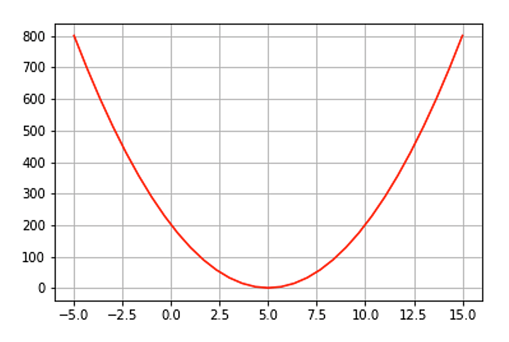

# Clusters loss function: measuring the quality of the cluster

**We need a way to tell us how suitable our clusters are for the data. In other words, how well our algorithm did on the clustering problem.**

This is where we need to employ some of the concepts of loss function. A loss function measures how much less than perfect our solution is, or how many errors or discrepancies are in our solution and how big these errors are. One popular way of doing this is by using the sum of the squares of the error for each data point in the dataset. But what could the errors be here? After all, we do not assume that we have labels here (although we might, more on that later). Take a moment to think about this.

OK, in fact, we can use the distances themselves as indication of the errors. We will calculate the sum of the squared distances between each data point in a cluster and the cluster’s centroid

$$
J_{i}=\sum_{\mathbf{x} \in \boldsymbol{C}_{i}} d\left(\boldsymbol{c}_{i}, \mathbf{x}\right)^{2}
$$

where $J_{i}$ is the loss of cluster $\boldsymbol{C}_{i}$.

Further, because we have multiple clusters, we sum these quantities for all the clusters which result in the following SSE (sum of squared errors) loss function:

$$
J=\sum_{i=1}^{K} \sum_{\mathbf{x} \in \boldsymbol{C}_{i}} d\left(\boldsymbol{c}_{i}, \mathbf{x}\right)^{2}
$$

This is a function of the centroids. So if we change the centroids the loss will change. How many values can these centroids take? Yes, they can take any real value, so it is infinite because of the continuity of real numbers. We need a way to search through all of these infinite values to find the ones that minimise this error or loss function. Luckily, there is a straightforward way to do this. You may recognise it from calculus.

Any continuous function has some stationary points. These are the optimums and the saddle points. We will not talk about saddle points in this unit, but you are encouraged to do some research yourself. Optimal points of a function are the points from the input space where the value of the function is either maximum or minimum in comparison with other values in the function. In our case, it is the minimums that we are interested in. Back to calculus; we can employ the idea of derivatives to obtain the minimum of a function.

For example, if we have the following function:

$$
y=(x-5)^{2}+8
$$

This function has the following shape, shown in figure 1.5:

**
Figure 1.5:** *plot of minimum $y=(x-5)^{2}+8$, showing its minimum at $x=5$.*

To obtain the minimum of this function we differentiate it:

$$
\frac{d y}{d x}=2(x-5)
$$

On the optimal points, the derivative of the function is always 0 because the angle of the slope becomes 0. On the bottom of a function there is no slope. So to obtain the minimum we set the derivative of the function to 0 and we solve for x that minimises the function.

$$
\begin{array}{c}
\frac{d y}{d x}=2(x-5)=0 \\
x=5
\end{array}
$$

That is cool because we can see that $x=5$ is indeed where the function becomes the least. Before that it was decreasing and after this point it is increasing. So there you have it, this is how we find the minimum of a function.

This was for one variable function, but for functions with multiple variables (attributes) we have to take partial derivative with respect to the variable that we want to minimise the function at. If we want to find the minimum for multiple variables at once, we take the gradient of the function, which is nothing but a series of partial derivatives with specific direction. You can find out more about this from any source such as Khan Academy or any calculus course. But the idea is really simple, we take the derivative and we set to 0. We are going to utilise this trick in several units, so please familiarise yourself with it. This process is called optimisation.

**OK, let us direct our attention back into minimising our loss function. The loss function can be written as:**

$$
J=\sum_{i=1}^{K} \sum_{\mathbf{x} \in \boldsymbol{C}_{i}}\left\|\boldsymbol{c}_{i}-\mathbf{x}\right\|^{2}
$$

We need to minimise the loss with respect to the different centroids. Our function has several variables (the centroids) each has several components (the attributes). But do not worry that is not a problem. We will take the gradient for each centroid separately. Given centroid $\boldsymbol{C}_{k}$ (small $k$ not the total number of clusters $K$) we take the derivative of the cost function with respect to the centroid $\boldsymbol{C}_{k}$ and we set it to 0 to get:

$$
\nabla J\left(\boldsymbol{c}_{k}\right)=\sum_{\mathbf{x} \in \boldsymbol{C}_{k}} 2\left(\boldsymbol{c}_{k}-\mathbf{x}\right)=0
$$

$$
\sum_{\mathbf{x} \in C_{k}} c_{k}=\sum_{\mathbf{x} \in \boldsymbol{C}_{k}} \mathbf{x}
$$

$$
c_{k}\left|C_{k}\right|=\sum_{\mathbf{x} \in \boldsymbol{C}_{k}} \mathbf{x}
$$

where $\left|\boldsymbol{C}_{k}\right|$ is the number of data points in cluster $\boldsymbol{C}_{k}$. Therefore we have:

$$
c_{k}=\frac{1}{\left|C_{k}\right|} \sum_{\mathbf{x} \in C_{k}} \mathbf{x}
$$

This is the formula for calculating the centroids (the means) that we have used already. This shows that the K-means algorithm is indeed minimising the loss function SSE by assigning each centroid to the mean of the cluster. Note that we denoted the derivative with $\nabla J$ because it is the gradient of a function with respect of a vector $\boldsymbol{c}_{k}$ (each point in multi-dimensional space is actually a vector since we have multiple attributes for each centroid).

See this video for explanation of the above concepts.

<iframe title="Cluster analysis 1" width="450" height="300" frameborder="0" scrolling="auto" marginheight="0" marginwidth="0" src=" https://mymedia.leeds.ac.uk/Mediasite/Play/6f4dcc6d61c84d81bc17a1afb29ddca91d" allowfullscreen msallowfullscreen allow="fullscreen"></iframe>

You can download the <a href="https://minerva.leeds.ac.uk/bbcswebdav/xid-18826428_4" target="_blank">slides shown in the video.</a>

Slides are reproduced from Tan et al (2019), <a href="https://www-users.cs.umn.edu/~kumar001/dmbook/index.php#item4" target="_blank">Introduction to Data Mining</a>, with kind permission of the authors.

!!! abstract "Exercise"
     See this Jupyter Notebook for a hands on, looking at the correspondence between the minimum of SSE and the mean of a cluster.

    - Download exercise (.ipynb): <a href="../files/Exercise1_SSEMinimisation.ipynb" download>Exercise 1</a>
