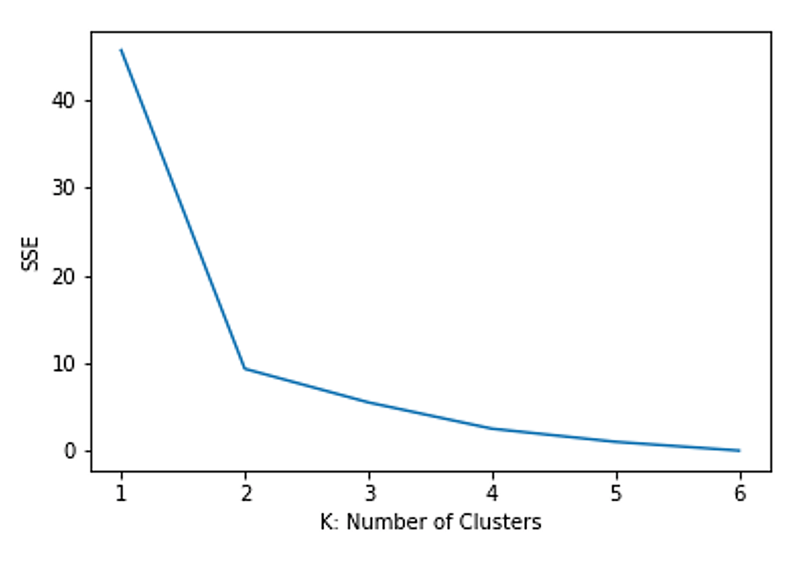

# Specifying K through elbow method

**Our aim in the last section was to minimise this loss function. One way of doing that is by increasing the number of clusters $K$.**

The more we increase $K$ the more localised and spread our clusters are and the less our loss function is going to be. There is however a sweet spot, where if we try to increase $K$ the loss function does not decrease that much. This is a viable root to specify $K$ itself. We can employ the elbow method that shows how the SSE is trending down until it slows down, creating an elbow shaped figure on the way.

This elbow is an indication of where the SSE is saturated and further increase of $K$ will not benefit. Figure 1.6 below shows an example:

user | Jaws | Star Wars | The Exorcist | The Omen |
-----|------|-----------|--------------|----------|
John|5|5|2|1|
Mary|4|5|3|2|
Bob|4|4|4|3|
Lisa|2|2|4|5|
Lee|1|2|3|4|
Harry|2|1|5|5|

**
Figure 1.6:** *Elbow method for a simple movie dataset of 6 users and their ranking for 4 movies. The figure shows that SSE slowed down significantly at K=2, the elbow of the figure, which means K=2 is the optimal value for this clustering problem. Clearly two clusters is the optimal choice in this case.*

!!! Abstract "Exercise"

    Please see the following tutorial in <a href="https://leeds365-my.sharepoint.com/:u:/r/personal/scsaalt_leeds_ac_uk/Documents/Downloads/Resources%20for%20ODL%20MSc/Data%20Science%20Contents/unit5/code/ClusteringAlgorithms.ipynb?csf=1&web=1&e=88fAur" target="_blank">Jupyter notebook</a>for a pure Python K-means algorithm implementation.
