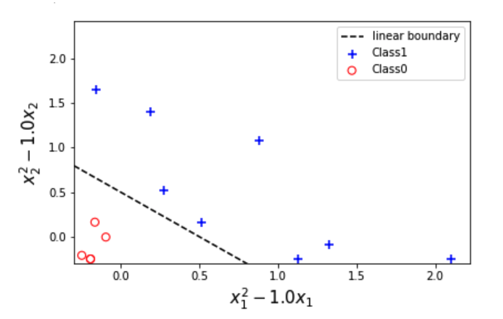
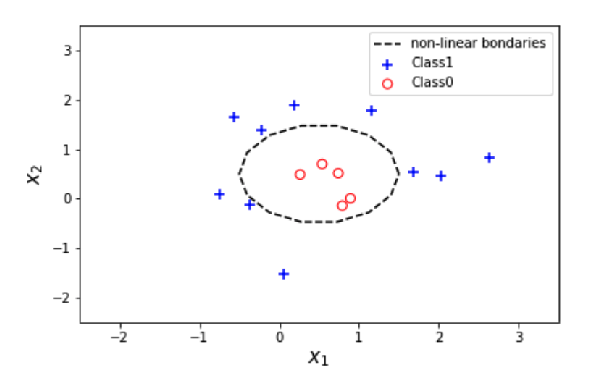
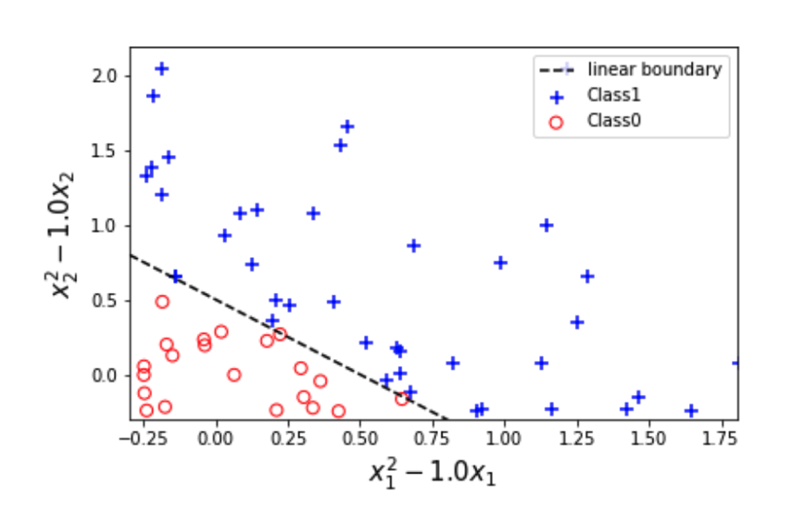

# Binary classification: The perceptron  

**For the dataset that consists of $\mathbf{x}_{n}$ and its targets label $t_{n}$ where $n=1, \ldots, N$, we want to compare between the predicted labels and the targets labels.**

The issue with the step function is that it is not differentiable so we would want to combine the prediction with the target and only look at cases when there is misclassification. But we can dispense with the activation function and replace it with a different term that implicitly incorporates the activation function without explicitly using it. The trick is that since the target values themselves are -1 and +1:

1. We can multiply the target $t_n$ by the linear discriminant $\mathbf{w}^{\top} \mathbf{x}_{n}$ to get $J_{n}=\mathbf{w}^{\top} \mathbf{x}_{n} t_{n}$
2. Check their sign. If the signs are the same we will get a positive value while if they are different we will get a negative value (scroll right to see full equation).

$$
\left\{\begin{array}{ccccc}
& & \text { correct classification } & & \\
\mathbf{w}^{\top} \mathbf{x}_{n} \geq 0 & \text { and } & t_{n}=+1 & \text { then } \mathbf{w}^{\top} \mathbf{x}_{n} t_{n} \geq 0 \\
\mathbf{w}^{\top} \mathbf{x}_{n}<0 & \text { and } & t_{n}=-1 & \text { then } & \mathbf{w}^{\top} \mathbf{x}_{n} t_{n}>0 \\
& & \text { mis-classification } & & \\
\mathbf{w}^{\top} \mathbf{x}_{n} \geq 0 & \text { and } & t_{n}=-1 & \text { then } & \mathbf{w}^{\top} \mathbf{x}_{n} t_{n} \leq 0 \\
\mathbf{w}^{\top} \mathbf{x}_{n}<0 & \text { and } & t_{n}=+1 & \text { then } & \mathbf{w}^{\top} \mathbf{x}_{n} t_{n}<0
\end{array}\right.
$$

So all data points that are misclassified will have a negative value,

3. Hence the loss-like function (called the perceptron criterion) can be written be make positive by multiplying all the misclassified data points by -1 to get:

$$
J(\mathbf{w})=\sum_{n \in \mathcal{M}} J_{n}=\sum_{n \in \mathcal{M}}-\mathbf{w}^{\top} \mathbf{x}_{n} t_{n}
$$

Where $\mathcal{M}$ represents the set of **misclassified** data points in the dataset. Note that if a case lies exactly on the boundary then we assume it is of class +1. We call the model that uses this trick the perceptron. In figure 3.1 below we show a schematic representation of the perceptron.

<figure role="group">
  
  <figcaption>
    
<strong>Figure 3.1: Schematic representation of the perceptron as a linear model for classification.</strong>

  </figcaption>
</figure>

Note how similar this is to a linear regression model. The main difference is the inclusion of the step activation function $f$ (which is represented with sharp edges inside the circle) and of course the fact that we require the class's labels to be +1 or -1. The circle represents a computation unit that we call a neuron in analogy with the neural networks. However, we do not attempt to make explicit links with biology, we merely look at this as a convenient name that will be useful when we deal with multiple neurons later on.

Now we have a loss function that is actually differentiable with respect to $\mathbf{w}$ and we can simply apply either the least squares or the stochastic gradient descent algorithms, similar to what we did for regression.

$$
\begin{array}{l}
\mathbf{w}^{(\tau+1)}=\mathbf{w}^{(\tau)}-\eta \nabla J_{n} \\
\mathbf{w}^{(\tau+1)}=\mathbf{w}^{(\tau)}-\eta\left(-\mathbf{x}_{n} t_{n}\right) \\
\mathbf{w}^{(\tau+1)}=\mathbf{w}^{(\tau)}+\eta \mathbf{x}_{n} t_{n}
\end{array}
$$

We will show the full algorithm of training the perceptron in the next section, but first let us talk a bit about the feature space.

The training for the perceptron is performed as follows. We cycle through all the instances $\mathbf{x}_{n}$ (aka data points or patterns) and we evaluate $\mathbf{w}^{\top} \mathbf{x}_{n} t_{n}$, we pick only those that have been misclassified i.e. those that have $\mathbf{w}^{\top} \mathbf{x}_{n} t_{n}<$ 0 ; and we update the weights for these instances according to the above formula. This checking however, does not allow us to directly use the vectorised version of the mini-batch, rather we will resort to the basic mini-batch Algorithm 4 which enumerates through the training set one pattern at a time.

Nevertheless, there are ways of making this algorithm more efficient by using general matrices operations other than the traditional multiplication and addition. The condition can be written in a matrices form as follows:

$$
\mathbf{m}=\mathbf{X} \mathbf{w} \circ \mathbf{t}>0
$$

where $\circ$ denotes element-wise multiplication of each component. This operation generates a set of true/false values that can be interpreted as a 0,1 vector. This vector can be masked as an index of a matrix. This will allow us to efficiently express an update over an entire dataset as follows:

$$
\mathbf{w}^{(\tau+1)}=\mathbf{w}^{(\tau)}+\eta \mathbf{X}[\mathbf{m}] \mathbf{t}[\mathbf{m}]
$$

In fact, we can omit the learning rate because multiplying by it (or not) will not change the sign of the criterion. Since learning occurs only when the sign is changed, the learning rate will not affect the result (but the changes in the weights are going to be different when we do not use it).

##Moving into feature space: generalised linear models for classification

As we have seen earlier in regression, all algorithms and techniques can be directly applied when we move from the input space $\mathbf{x}$ into a feature space $\boldsymbol{\phi}$ often that have higher dimension than $\mathbf{x}$. The benefit of mapping into a new higher dimension feature space is that it will potentially render the non-linearity of the class's boundaries in $\mathbf{x}$ into linear boundaries in $\boldsymbol{\phi}$ as we can see in figure 3.2 below.

<figure role="group">
  
  <figcaption>
    
<strong>Figure 3.2: Two examples of the benefit of mapping input space to a feature space, where the data becomes linearly separable. .</strong>

  </figcaption>
</figure>

The data in the above figures was generated according to a circle boundary:

$$
\left(x_{1}-a\right)^{2}+\left(x_{2}-b\right)^{2}=r^{2}
$$

Expanding the terms in the squared brackets gives us that:

$$
\left(x_{1}^{2}-2 a x_{1}\right)+\left(x_{2}^{2}-2 b x_{2}\right)=r^{2}-\left(a^{2}+b^{2}\right)
$$

By mapping (substitution) the data into a new space with new input features as follows:

$$
x_{1}^{\prime}=\left(x_{1}^{2}-2 a x_{1}\right), \quad x_{2}^{\prime}=\left(x_{2}^{2}-2 a x_{2}\right)
$$

$$
x_{1}^{\prime}+x_{2}^{\prime}=c \quad \text { where } \quad c=r^{2}-\left(a^{2}+b^{2}\right)
$$

Therefore, the circle boundary becomes a linear equation $x_{1}^{\prime}+x_{2}^{\prime}=c .$ in the figure above we have chosen $a=0.5$ and $b=0.5$ so the new feature space is characterised by $x_{1}^{\prime}=x_{1}^{2}-x_{1}$ and $x_{2}^{\prime}=$ $x_{2}^{2}-x_{2}$

!!! abstract "Exercise"

    Run the following Jupyter Notebook to see how moving to a different feature spaces can turn non-linearly separable classes into linearly separable classes.

    - Download exercise (.ipynb):  <a href="../exercises/MovingToFeatureSpaceBenfit.ipynb" target="_blank" download>Exercise (.ipynb)</a>

So from now on we will work on the feature space instead of the input space as we did for regression.

The gradient descent updates for the perceptron can be written as:

$$
\mathbf{w}^{(\tau+1)}=\mathbf{w}^{(\tau)}+\eta \boldsymbol{\phi}_{n} t_{n}
$$

The regularised version is given as:

$$
\mathbf{w}^{(\tau+1)}=(1-\eta \lambda) \mathbf{w}^{(\tau)}+\eta \boldsymbol{\phi}_{n} t_{n}
$$

Based on what we have covered in Algorithm 5 in Unit 4, we can directly apply a mini-batch stochastic gradient approach on the perceptron with regularisation which is shown below (scroll right within the box to see all information).

!!! algorithm-heading "Algorithms 1: Regularised Mini-Batch Stochastic Gradient Descent for Linear Classification ‎(Perceptron) with Radial Basis (see previous unit for other possible basis)"

    **Input:**

    !!! algorithm ""

        Input set: design matrix $\mathbf{X}=\left[\mathbf{x}_{1}^{\top}, \ldots, \mathbf{x}_{N}^{\top}\right]^{\top}$ each $\mathbf{x}_{n}$ is a vector of size $D \quad$
        # *Training set*

        Labels set: vector $\mathbf{t}=\left[t_{1}, \ldots, t_{N}\right]^{\top}$ each $t_{n}$ is a scalar
        # *Training set*

        $\eta:$ the learning rate

        $b$: The mini-batch size (specifies how frequently we want to update the weights $\mathbf{w}$ ).

        $epcs$: Number of epochs

        $\boldsymbol{\mu}_{j}: M$ Basis centres, each is a vector of size $D$

        $\boldsymbol{\Sigma}$ : Covariance matrix of size $\mathrm{D} \times \mathrm{D}$

    **Output:** $\mathbf{w}$ an approximation for optimum weights $\mathbf{w}^{*}$; a vector of size $M+1$

    **Perceptron**($\mathbf{X}$,$\mathbf{t}$,$\eta$,$b$,$epcs$):

    !!! algorithm ""

        Initialise $\mathbf{w}$ and set $\mathbf{w}^\prime=0$

        Map the data $\mathbf{X}$ into design matrix $\mathbf{\Phi}$
        # via the Gaussian basis $\phi_{j}\left(\mathbf{x}_{n}\right)=e^{-\frac{1}{2}\left(\mathbf{x}_{n}-\mu_{j}\right)^{\top} \Sigma^{-1}\left(\mathbf{x}_{n}-\mu_{j}\right)}$

        $\mathbf{\Phi}=[\mathbf{1}_N,\mathbf{\Phi}]$
        # *add dummy feature to the design matrix*

        For $epoch =\ 1:\ epcs$

        !!! algorithm ""

            For $n=1: N$

            !!! algorithm ""

                If $\mathbf{w}^{\top} \boldsymbol{\phi}_{n} t_{n}<0$

                !!! algorithm ""

                    $\mathbf{w}^{\prime}=\mathbf{w}^{\prime}+\eta \boldsymbol{\phi}_{n} t_{n}$
                    # *only update when the instance is misclassified*

                If $n \% b==0$
                # *there is a better condition see previous unit*

                !!! algorithm ""

                    $\mathbf{w}=\mathbf{w}+\mathbf{w}\prime$

                    $\mathbf{w}^\prime=\mathbf{0}$

        Return the final solution $\mathbf{w}$

From now on it will be sufficient for us to just refer to an algorithm from the regression sections and show the update rules that is specific to classification, but for completeness of coverage we state the algorithm without re-explaining its skeleton as this was done already in the regression unit.

<figure role="group">
  
  <figcaption>
    
<strong>Figure 3.3: Schematic representation of the perceptron as a linear model for classification with basis.</strong>

  </figcaption>
</figure>

It should be noted that if the classes are non-linearly separable the perceptron will not be able to classify them, but a multi-layer perceptron will be able to do so. A classical example is the XOR dataset shown below in figure 3.4. The dataset is called as such because it is generated from an XOR gate as follows:

| Input components $x$ | Input components $x$ | Output $y$          |
| -------------------- | -------------------- | ------------------- |
|        $x_{1}$       |         $x_{2}$      | $x_{1}$ or $x_{2}$  |
|        0             |         0            | 0                   |
|        0             |         1            | 1                   |
|        1             |         0            | 1                   |
|        1             |         1            | 0                   |

The XOR operation is based on the logical OR operation, except that it only allows one and only one of the two operands to be 1. As a reminder we state the ‘OR’ dataset below.

| Input components $x$ | Input components $x$ | Output $y$          |
| -------------------- | -------------------- | ------------------- |
|        $x_{1}$       |         $x_{2}$      | $x_{1}$ or $x_{2}$  |
|        0             |         0            | 0                   |
|        0             |         1            | 1                   |
|        1             |         0            | 1                   |
|        1             |         1            | 1                   |

Due the perfect alignment of point (1,0) and (0,1) as well as (0,0) and (1,1) there is no one line that can separate the XOR dataset: it is a non-linearly separable dataset. The perceptron is incapable of classifying all the data points correctly because it can generate one straight line decision boundary while the dataset requires at least two. The perceptron cannot classify the dataset due to intrinsic limitation and not because perceptron uses the labels {+1, -1} while the labels here are {0, 1}. This is easily solvable by mapping the labels -1 into 0's once the perceptron output the results.

<figure role="group">
  
  <figcaption>
    
<strong>Figure 3.4: XOR dataset.</strong>

  </figcaption>
</figure>

The perceptron is guaranteed (via the **perceptron convergence theorem**) to find a solution if the data is linearly separable. But if the data is not linearly separable it will never converge, i.e. it can keep running infinitely if the implementation allows for that. Even when the data in linearly separable the algorithm might take a considerable number of steps to converge. If we do not know a priori whether the data is linearly separable or not, we cannot tell if the perceptron is taking long to converge or it is unable to converge.

!!! abstract "Exercise"
    See the following Jupyter notebook for more details on the perceptron.

      - Download exercise (.ipynb): <a href="../exercises/Perceptron.ipynb" download>Exercise</a>

    Now, try to do the same thing in RapidMiner. You may want to refer to the earlier  RapidMiner video in unit 2. .
